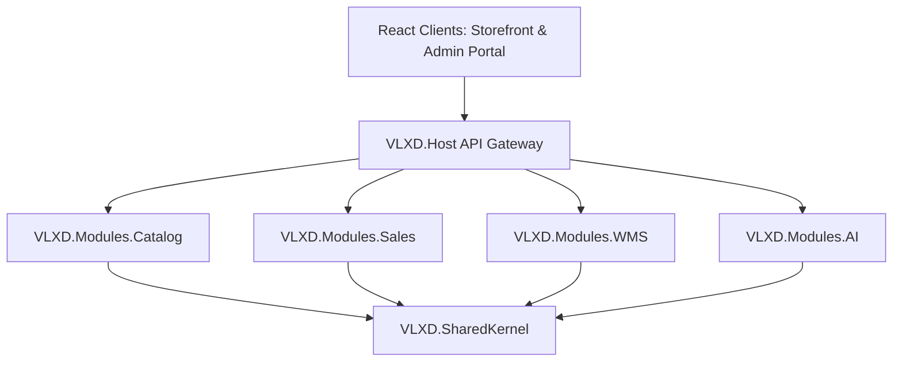
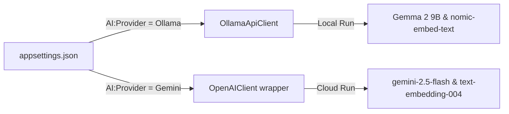

# 🏗 VLXD Smart System

> Enterprise Modular Monolith cho quản lý & bán vật liệu xây dựng (VLXD), 
> tích hợp AI tư vấn thông minh (RAG, Sentiment Analysis, Entity Extraction).

[](https://dotnet.microsoft.com/download)
[](https://react.dev)
[](https://www.microsoft.com/sql-server)
[](https://ollama.com)
[](https://ai.google.dev/)
[](LICENSE)

---

## 🌟 Tính Năng Nổi Bật

### 🛒 Storefront Client (B2C/B2B)
- **Danh mục vật tư**: Tìm kiếm sản phẩm thông minh kết hợp Full-Text Search và Fuzzy search.
- **AI Virtual Assistant Widget**: Tư vấn kỹ thuật xây dựng, tính toán vật liệu kèm tỉ lệ hao hụt định mức.
- **Giỏ hàng & Đơn hàng**: Áp dụng cơ chế chiết khấu tự động theo phân quyền tài khoản (Đại lý, Nhà thầu, Khách lẻ).
- **Theo dõi đơn hàng**: Mô phỏng định vị GPS của xe tải giao hàng thời gian thực.
- **Aesthetics**: Thiết kế giao diện kính mờ (Glassmorphism), tối ưu hóa trải nghiệm Light/Dark mode.

### 📊 Admin Portal Client (Management)
- **Dashboard**: Biểu đồ doanh thu, thống kê cảnh báo hết hàng (Low Stock), số lượng đơn hàng.
- **Quản lý Kho bãi & Phân loại**: Hỗ trợ CRUD nhiều kho hàng, phân loại sản phẩm đa cấp.
- **Quản lý AI & Tri thức**: Cho phép Admin kiểm duyệt danh sách chat sessions, xem sentiment cảm xúc của khách, xóa tin nhắn/session, xóa bộ nhớ AI hoặc kích hoạt vector hóa (embed) lại toàn bộ sản phẩm.
- **AI Báo giá nháp**: Tự động bóc tách văn bản thô từ tin nhắn khách gửi thành bảng báo giá chi tiết, Admin duyệt và chuyển đổi thành đơn hàng chính thức chỉ bằng 1-Click.
- **Hỗ trợ khách hàng (AI Support Tickets)**: Tự động tạo ticket hỗ trợ và phân công nhân viên khi phát hiện cảm xúc khách hàng tức giận (Negative Sentiment).

---

## 🏗 Kiến Trúc Hệ Thống (Modular Monolith)

Hệ thống được thiết kế theo cấu trúc Modular Monolith nhằm cô lập các vùng nghiệp vụ độc lập, giúp dễ dàng chuyển đổi sang Microservices khi cần thiết:



### 📁 Cơ cấu Schema Cô Lập trong SQL Server
Các Module sở hữu cơ sở dữ liệu riêng biệt được phân chia thông qua Schema:
*   `catalog`: Bảng sản phẩm, phân loại, giá bán và từ khóa đồng nghĩa.
*   `sales`: Khách hàng, giỏ hàng, đơn hàng, bảng báo giá nháp.
*   `wms`: Danh sách kho bãi, tồn kho chi tiết, stock movement, đội xe giao nhận.
*   `ai`: Sessions chat, lịch sử tin nhắn, support tickets, và bảng chứa vector embeddings.

---

## 🤖 Thiết Kế AI Adapter Pattern (Senior CV Highlight)

Mã nguồn module AI sử dụng bộ công cụ trừu tượng chuẩn hóa **Microsoft.Extensions.AI**. Điều này cho phép chuyển đổi linh hoạt ("rút phích cắm" model này cắm model khác) giữa môi trường Local và Cloud bằng cấu hình tại `appsettings.json`:



### Cách cấu hình trong `appsettings.json`:
1. **Chạy Ollama Local (Mặc định)**:
   ```json
   "AI": {
     "Provider": "Ollama",
     "Ollama": {
       "Endpoint": "http://localhost:11434",
       "ChatModel": "gemma2:9b",
       "EmbeddingModel": "nomic-embed-text"
     }
   }
   ```
2. **Chạy Gemini API Cloud**:
   ```json
   "AI": {
     "Provider": "Gemini",
     "Gemini": {
       "ApiKey": "YOUR_GEMINI_API_KEY",
       "ChatModel": "gemini-2.5-flash",
       "EmbeddingModel": "text-embedding-004"
     }
   }
   ```

---

## ⚙ Hướng Dẫn Cài Đặt & Chạy Local

### 1. Chuẩn bị
*   [.NET 9 SDK / .NET 10 SDK](https://dotnet.microsoft.com/download)
*   [Docker Desktop](https://www.docker.com)
*   [Node.js (v18+)](https://nodejs.org)
*   [Ollama](https://ollama.com) (nếu chạy AI local)

### 2. Khởi tạo Cơ sở dữ liệu (SQL Server)
Khởi động container chứa SQL Server 2022:
```bash
docker compose up -d
```
> [!NOTE]
> Database sẽ tự động được khởi tạo, chạy migrations và nạp dữ liệu mẫu (Seeded Data) đầy đủ trong lần khởi chạy backend đầu tiên.

### 3. Cấu hình local secrets (Tùy chọn)
Tạo file `src/VLXD.Host/appsettings.Development.json` để chạy thử dưới local:
```json
{
  "ConnectionStrings": {
    "DefaultConnection": "Server=localhost,1433;Database=VlxdDb;User Id=sa;Password=VlxdDev@2024;TrustServerCertificate=true;"
  },
  "JwtSettings": {
    "SecretKey": "VlxdSmartSystem2024SuperSecretKeyThatIsLongEnough!"
  },
  "AI": {
    "Provider": "Gemini", // hoặc Ollama
    "Gemini": {
      "ApiKey": "API_KEY_CỦA_BẠN"
    }
  }
}
```

### 4. Chạy Backend API
Khởi chạy Host API Gateway:
```bash
dotnet build
dotnet run --project src/VLXD.Host
```

### 5. Chạy Storefront Frontend (Khách hàng)
```bash
cd src/Clients/storefront
npm install
npm run dev
```
Truy cập tại: [http://localhost:5173](http://localhost:5173)

### 6. Chạy Admin Portal Frontend (Quản trị viên)
```bash
cd src/Clients/admin-portal
npm install
npm run dev
```
Truy cập tại: [http://localhost:5174](http://localhost:5174)

---

## 🔐 Tài Khoản Khởi Tạo Sẵn (Seeded Accounts)

Bạn có thể đăng nhập bằng các tài khoản mẫu sau để test phân quyền:

| Phân quyền | Email đăng nhập | Mật khẩu mặc định | Nghiệp vụ hiển thị |
|---|---|---|---|
| **Admin** | `admin@vlxd.local` | `Admin@123` | Toàn quyền quản trị, Quản lý tài khoản, Quản lý AI |
| **Nhân viên (Employee)** | `sale@vlxd.local` | `Sale@123` | Quản lý đơn hàng, Duyệt báo giá nháp, Đội xe, Kho hàng |
| **Khách hàng (Customer)** | `khach@vlxd.local` | `Khach@123` | Đặt hàng, theo dõi giao hàng, chat với trợ lý ảo AI |

---

## 🧪 Chạy Kiểm Thử (Testing)

Hệ thống có bộ test suite bao gồm 39 ca kiểm thử Unit và Integration tests:
```bash
dotnet test
```

## 📝 Giấy Phép
Mã nguồn phát hành dưới giấy phép MIT License.
