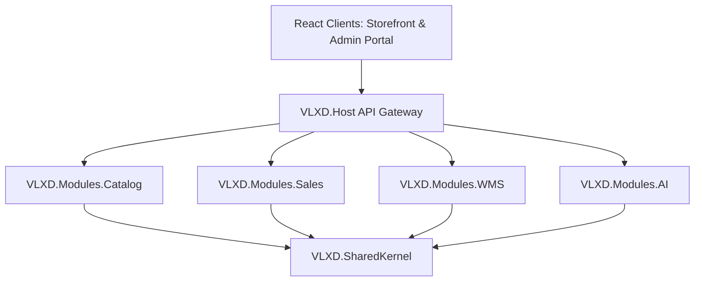
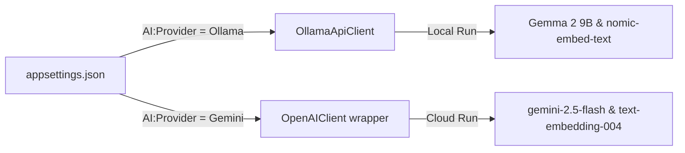

# 🏗 VLXD Smart System

> Enterprise Modular Monolith for building materials (VLXD) management & sales,
> integrated with smart AI assistants (RAG, Sentiment Analysis, Entity Extraction).

[](https://dotnet.microsoft.com/download)
[](https://react.dev)
[](https://www.microsoft.com/sql-server)
[](https://ollama.com)
[](https://ai.google.dev/)
[](LICENSE)

🌐 **[Bản tiếng Việt](README.md)**

---

## 🌟 Feature Highlights

### 🛒 Storefront Client (B2C/B2B)
- **Product Catalog**: Smart product searching combining SQL Server Full-Text Search and fuzzy search algorithms.
- **AI Virtual Assistant Widget**: Dynamic construction engineering consultancy, calculating required material amounts with standard waste margins.
- **Cart & Order Processing**: Automated tier-based discount system mapped to user accounts (Dealer, Contractor, Retail Customer).
- **Delivery Tracking**: Live real-time GPS simulation tracking for delivery trucks.
- **Aesthetics**: Premium Glassmorphism UI layout optimized with flawless Light/Dark mode transitions.

### 📊 Admin Portal Client (Management)
- **Dashboard**: Interactive revenue charts, low stock alerts, and real-time order statistics.
- **Warehouse & Category Management**: Dynamic CRUD operations for multiple warehouses and hierarchical multi-level product categorization.
- **AI & Knowledge Base Management**: Full administrative control to inspect chat sessions, analyze client sentiment, delete session histories/messages, purge AI memory, or trigger a complete database embedding re-indexing.
- **AI-Powered Draft Quotations**: Automatically parses unstructured raw client messages to generate a structured draft quotation table, which admins can convert to a formal order with a single click.
- **AI Customer Support Tickets**: Automatically creates support tickets and assigns staff when the system detects anger or negative sentiment in a client's message.

---

## 🏗 System Architecture (Modular Monolith)

The system is built on a Modular Monolith architecture to guarantee domain isolation between independent business areas, ensuring a seamless migration path to microservices if needed in the future:



### 📁 Schema-Isolated Database Design in SQL Server
Database tables are strictly separated by schema boundaries to preserve module boundaries:
*   `catalog`: Products, categories, pricing, and product search synonyms.
*   `sales`: Customers, carts, orders, and AI-parsed draft quotations.
*   `wms`: Warehouses, detailed inventory stock, stock movement logs, and delivery fleet/vehicles.
*   `ai`: Chat sessions, message history logs, support tickets, and vector embedding tables.

---

## 🤖 AI Adapter Pattern (Senior CV Highlight)

The AI module uses the standardized **Microsoft.Extensions.AI** abstraction library. This decoupling allows you to hot-swap ("plug and play") the active LLM provider between Local and Cloud models at runtime via simple configuration switches in `appsettings.json`:



### Configuration in `appsettings.json`:
1. **Local Ollama Mode (Default)**:
   ```json
   "AI": {
     "Provider": "Ollama",
     "Ollama": {
       "Endpoint": "http://localhost:11434",
       "ChatModel": "gemma2:9b",
       "EmbeddingModel": "nomic-embed-text"
     }
   }
   ```
2. **Cloud Gemini API Mode**:
   ```json
   "AI": {
     "Provider": "Gemini",
     "Gemini": {
       "ApiKey": "YOUR_GEMINI_API_KEY",
       "ChatModel": "gemini-2.5-flash",
       "EmbeddingModel": "text-embedding-004"
     }
   }
   ```

---

## ⚙ Installation & Local Setup

### Prerequisites
*   [.NET 9 SDK / .NET 10 SDK](https://dotnet.microsoft.com/download)
*   [Docker Desktop](https://www.docker.com)
*   [Node.js (v18+)](https://nodejs.org)
*   [Ollama](https://ollama.com) (for local AI inference)

### 1. Database Initialization (SQL Server)
Spin up the SQL Server 2022 docker container:
```bash
docker compose up -d
```
> [!NOTE]
> Database schemas will automatically initialize, apply EF migrations, and seed sample test data during the first run of the backend.

### 2. Configure Local Secrets (Optional)
Create `src/VLXD.Host/appsettings.Development.json` for your local environment parameters:
```json
{
  "ConnectionStrings": {
    "DefaultConnection": "Server=localhost,1433;Database=VlxdDb;User Id=sa;Password=VlxdDev@2024;TrustServerCertificate=true;"
  },
  "JwtSettings": {
    "SecretKey": "VlxdSmartSystem2024SuperSecretKeyThatIsLongEnough!"
  },
  "AI": {
    "Provider": "Gemini", // or Ollama
    "Gemini": {
      "ApiKey": "YOUR_API_KEY_HERE"
    }
  }
}
```

### 3. Run Backend API
Launch the API Gateway Host:
```bash
dotnet build
dotnet run --project src/VLXD.Host
```

### 4. Run Storefront Client (B2C Front-end)
```bash
cd src/Clients/storefront
npm install
npm run dev
```
Open your browser at: [http://localhost:5173](http://localhost:5173)

### 5. Run Admin Portal Client (Management Front-end)
```bash
cd src/Clients/admin-portal
npm install
npm run dev
```
Open your browser at: [http://localhost:5174](http://localhost:5174)

---

## 🔐 Seeded Accounts (Test Credentials)

Login using these pre-seeded demo accounts to test permission and role access levels:

| Role | Email Login | Default Password | Visible Portals & Capabilities |
|---|---|---|---|
| **Admin** | `admin@vlxd.local` | `Admin@123` | Full administration, user accounts management, AI oversight & session control |
| **Employee (Sales)** | `sale@vlxd.local` | `Sale@123` | Order processing, draft quote approval, fleet dispatch, inventory logs |
| **Customer** | `khach@vlxd.local` | `Khach@123` | Product browsing, order placement, vehicle tracking, chatbot interaction |

---

## 🧪 Testing

Execute the test suite consisting of 39 automated integration & unit tests:
```bash
dotnet test
```

## 📝 License
This source code is licensed under the MIT License.
