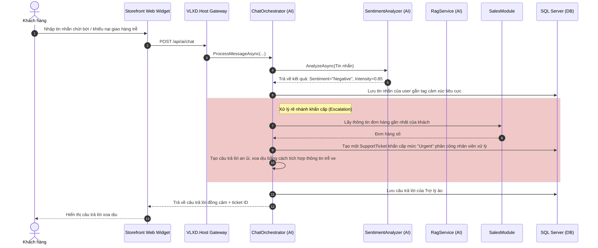

# 🏗 Hướng Dẫn Kiến Trúc & Hoạt Động Hệ Thống (Architecture & Module Guide)

Tài liệu này cung cấp cái nhìn chi tiết và toàn diện nhất về cấu trúc thư mục, thiết kế kiến trúc, cách thức hoạt động và luồng dữ liệu của từng Module trong dự án **VLXD Smart System**. Đây là cẩm nang thiết yếu giúp lập trình viên mới gia nhập dự án nhanh chóng nắm bắt mã nguồn và vận hành hệ thống một cách hiệu quả.

---

## 📖 Mục Lục
1. [Tổng Quan Kiến Trúc Hệ Thống (Modular Monolith)](#1-tổng-quan-kiến-trúc-hệ-thống-modular-monolith)
2. [Cấu Trúc Thư Mục Toàn Dự Án](#2-cấu-trúc-thư-mục-toàn-dự-án)
3. [Giao Tiếp Giữa Các Module (Inter-Module Communication)](#3-giao-tiếp-giữa-các-module-inter-module-communication)
4. [Phân Tích Chi Tiết Từng Module Backend](#4-phân-tích-chi-tiết-từng-module-backend)
    - [4.1. SharedKernel (Lõi chia sẻ)](#41-sharedkernel-lõi-chia-sẻ)
    - [4.2. Catalog Module (Quản lý Danh mục Vật tư)](#42-catalog-module-quản-lý-danh-mục-vật-tư)
    - [4.3. Sales Module (Quản lý Bán hàng & Khách hàng)](#43-sales-module-quản-lý-bán-hàng--khách-hàng)
    - [4.4. WMS Module (Quản lý Kho bãi & Vận chuyển)](#44-wms-module-quản-lý-kho-bãi--vận-chuyển)
    - [4.5. AI Module (Trí tuệ nhân tạo tư vấn & Giám sát)](#45-ai-module-trí-tuệ-nhân-tạo-tư-vấn--giám-sát)
5. [Cơ Chế AI Cú Pháp Cao Cấp (RAG, Sentiment, Adapter)](#5-cơ-chế-ai-cú-pháp-cao-cấp-rag-sentiment-adapter)
6. [Luồng Nghiệp Vụ Thực Tế Quan Trọng (Workflow Deep Dives)](#6-luồng-nghiệp-vụ-thực-tế-quan-trọng-workflow-deep-dives)
7. [Kiến Trúc Frontend Clients (Storefront & Admin Portal)](#7-kiến-trúc-frontend-clients-storefront--admin-portal)
8. [Phân Quyền & Bảo Mật Hệ Thống (Authentication & Authorization)](#8-phân-quyền--bảo-mật-hệ-thống-authentication--authorization)
9. [Hướng Dẫn Cho Developer Mới Triển Khai (Onboarding Guide)](#9-hướng-dẫn-cho-developer-mới-triển-khai-onboarding-guide)

---

## 1. Tổng Quan Kiến Trúc Hệ Thống (Modular Monolith)

Hệ thống **VLXD Smart System** được xây dựng dựa trên kiến trúc **Modular Monolith** (Đơn khối dạng mô-đun) chạy trên nền tảng **.NET 10**. 

### Tại sao lại chọn Modular Monolith thay vì Microservices?
1. **Cô lập nghiệp vụ tốt nhưng vận hành đơn giản:** Các module (Catalog, Sales, WMS, AI) được tách biệt thành các Class Library riêng trong Solution. Mỗi module đóng gói toàn bộ logic nghiệp vụ (Domain, Application, Infrastructure, Api) của nó.
2. **Triển khai dễ dàng:** Toàn bộ hệ thống được biên dịch và đóng gói thành một file chạy duy nhất (`VLXD.Host`), giúp giảm chi phí triển khai hạ tầng.
3. **Chuyển đổi linh hoạt sang Microservices:** Do ranh giới cơ sở dữ liệu và mã nguồn giữa các module được phân định nghiêm ngặt, khi một module cần scale độc lập, ta có thể dễ dàng tách project class library đó ra thành một microservice chạy riêng mà không làm vỡ các module còn lại.

### Sơ đồ tương tác tổng quát:
```mermaid
graph TD
    Client_Storefront[🛒 Storefront Client - React 19] -->|HTTPS Requests| Host[🚀 VLXD.Host API Gateway]
    Client_Admin[📊 Admin Portal - React 19] -->|HTTPS Requests| Host
    
    subgraph Modular Monolith Container (VLXD.Host)
        Host --> Catalog[📦 VLXD.Modules.Catalog]
        Host --> Sales[💰 VLXD.Modules.Sales]
        Host --> WMS[🚚 VLXD.Modules.WMS]
        Host --> AI[🧠 VLXD.Modules.AI]
    end

    subgraph SQL Server (Isolated Schemas)
        Catalog --> DB_Catalog[(schema: catalog)]
        Sales --> DB_Sales[(schema: sales)]
        WMS --> DB_WMS[(schema: wms)]
        AI --> DB_AI[(schema: ai)]
    end
    
    subgraph Local / Cloud AI Models
        AI -->|Microsoft.Extensions.AI| Ollama[(Local Ollama)]
        AI -->|Microsoft.Extensions.AI| Gemini[(Google Gemini Cloud API)]
    end
```

---

## 2. Cấu Trúc Thư Mục Toàn Dự Án

Thư mục dự án được tổ chức khoa học theo mô hình **DDD (Domain-Driven Design)** thu nhỏ bên trong mỗi Module:

```text
speedrunapp/
├── src/
│   ├── VLXD.Host/                      # Dự án chạy chính (Startup/Host Project)
│   │   ├── Auth/                       # Quản lý tài khoản Identity và cấp phát JWT Token
│   │   ├── Data/                       # ApplicationDbContext (Bảng Identity) & DbSeeder
│   │   └── Program.cs                  # Nơi cấu hình DI, middleware và đăng ký các Module
│   │
│   ├── VLXD.SharedKernel/              # Lõi dùng chung (Core abstractions)
│   │   ├── Domain/                     # Base Entity, AggregateRoot, IDomainEvent, Result pattern
│   │   └── Application/                # Hợp đồng giao tiếp (Contracts) ICatalogModule, IWmsModule...
│   │
│   └── Modules/                        # Thư mục chứa các module nghiệp vụ tách biệt
│       ├── VLXD.Modules.Catalog/       # Module Catalog quản lý hàng hóa vật tư
│       ├── VLXD.Modules.Sales/         # Module Sales quản lý đơn hàng, báo giá và khách hàng
│       ├── VLXD.Modules.WMS/           # Module WMS quản lý kho bãi, tồn kho và đội xe vận chuyển
│       └── VLXD.Modules.AI/            # Module AI xử lý RAG, Vector Search, Sentiment, Ticket
│
│── src/Clients/                        # Thư mục Frontend
│   ├── storefront/                     # React 19 Client dành cho khách hàng B2C/B2B
│   └── admin-portal/                   # React 19 Client dành cho Admin & Nhân viên bán hàng
│
├── docker-compose.yml                  # File chạy Docker SQL Server
└── README.md & README_EN.md            # Tài liệu dự án
```

### Cấu trúc chi tiết bên trong một Module (ví dụ: `VLXD.Modules.Catalog`):
*   **Domain/**: Chứa các thực thể gốc (`Entities`), Value Objects và các logic nghiệp vụ lõi (ví dụ: `Product.cs`, `Category.cs`).
*   **Application/**: Chứa các lớp xử lý nghiệp vụ, DTOs (`Data Transfer Objects`) và Validators bằng FluentValidation (ví dụ: `ProductDto.cs`, `CreateProductRequestValidator.cs`).
*   **Infrastructure/**: Cấu hình Entity Framework, DbContext riêng của module, file Migrations và các implementation của module contract (ví dụ: `CatalogDbContext.cs`, `CatalogModuleService.cs`).
*   **Api/**: Định nghĩa các Minimal API endpoints để expose các route HTTP ra bên ngoài (ví dụ: `CatalogEndpoints.cs`).
*   **`CatalogModule.cs`**: Điểm neo cấu hình DI (Dependency Injection) của riêng Module đó.

---

## 3. Giao Tiếp Giữa Các Module (Inter-Module Communication)

Các Module không được phép liên kết hoặc truy vấn trực tiếp bảng cơ sở dữ liệu của module khác. Họ giao tiếp qua 2 hình thức:

### 3.1. Giao Tiếp Đồng Bộ (Synchronous) thông qua Service Contract
Được định nghĩa trong `VLXD.SharedKernel/Application/Contracts`. Mỗi module cung cấp một Service hiện thực hóa giao diện đó.
*   *Ví dụ:* Khi Module `WMS` cần xác thực sản phẩm tồn tại trong Catalog lúc nhập kho, nó sẽ gọi:
    ```csharp
    var product = await _catalogModule.GetProductByIdAsync(request.ProductId);
    ```
*   *Luồng DI:* Interface `ICatalogModule` được khai báo ở SharedKernel, được triển khai bởi `CatalogModuleService` trong Catalog Module, và được đăng ký vào DI Container lúc ứng dụng khởi chạy.

### 3.2. Giao Tiếp Bất Đồng Bộ (Asynchronous) thông qua Domain Events
Dùng thư viện **MediatR** để phát đi các sự kiện trong bộ nhớ khi có biến động dữ liệu.
*   *Ví dụ:* Khi một đơn hàng được tạo trong Sales Module, Sales Module phát đi sự kiện `OrderPlacedEvent`.
*   *Người nghe:* WMS Module đăng ký một Handler là `ReserveStockOnOrderPlacedHandler` để lắng nghe sự kiện này và tự động cấn trừ (giữ trước) số lượng tồn kho tương ứng trong kho bãi mà không cần Sales Module phải biết.
```text
[Sales: Order Placed] ──(Publish Event via MediatR)──> [MediatR Bus] ──(Dispatched to)──> [WMS: ReserveStockOnOrderPlacedHandler]
```

---

## 4. Phân Tích Chi Tiết Từng Module Backend

### 4.1. SharedKernel (Lõi chia sẻ)
*   **Chức năng:** Chứa cấu trúc DDD cơ bản và các hợp đồng giao tiếp (Contracts).
*   **Thành phần chính:**
    *   `Entity`, `AggregateRoot`: Cung cấp Id (Guid), thời gian tạo (`CreatedAt`, `UpdatedAt`), danh sách Domain Events đi kèm.
    *   `Result`, `PagedResult`: Mô hình trả về chuẩn hóa (tránh ném ra ngoại lệ/exception làm giảm hiệu năng hệ thống).
    *   Các Contracts chính: `ICatalogModule.cs`, `ISalesModule.cs`, `IWmsModule.cs`.

### 4.2. Catalog Module (Quản lý Danh mục Vật tư)
*   **Cơ sở dữ liệu (Schema: `catalog`):**
    *   `Categories`: Danh mục đa cấp (sử dụng quan hệ đệ quy cha-con `ParentId`).
    *   `Products`: Thông tin chung của vật tư (SKU, Tên, Định mức phủ diện tích, Tỷ lệ hao hụt mặc định, Đơn vị tính).
    *   `PriceTiers`: Định nghĩa mức giá bán khác nhau cho cùng một sản phẩm dựa trên vai trò khách hàng (Đại lý, Nhà thầu, Khách lẻ) và số lượng mua tối thiểu.
    *   `ProductSpecs`: Thông số kỹ thuật động dưới dạng Key-Value (ví dụ: Độ bền nén, kích thước hạt, hãng sản xuất).
    *   `ProductAliases`: Bảng từ đồng nghĩa (ví dụ: xi măng -> ximang, bột trét -> matit) hỗ trợ fuzzy search.
*   **Cách thức hoạt động & Tối ưu:**
    *   Cache danh mục: Cây danh mục `categories` được cache trong RAM bằng `IMemoryCache` (key `catalog_categories_tree`) để tránh truy vấn đệ quy DB liên tục. Bộ cache này tự động bị vô hiệu hóa (Clear/Evict) khi Admin thực hiện CRUD danh mục.

### 4.3. Sales Module (Quản lý Bán hàng & Khách hàng)
*   **Cơ sở dữ liệu (Schema: `sales`):**
    *   `Customers`: Lưu thông tin khách hàng đồng bộ từ bảng Identity và phân nhóm đại lý/nhà thầu (`CustomerTier`).
    *   `Orders` & `OrderItems`: Chi tiết hóa đơn mua sắm của khách.
    *   `Quotations` & `QuotationItems`: Bảng nháp báo giá được tạo từ AI trích xuất thực thể.
*   **Cách thức hoạt động nổi bật:**
    *   **Áp giá tự động:** Khi khách hàng hoặc nhân viên đặt hàng, hệ thống tự động kiểm tra vai trò khách hàng từ `Customers` và số lượng trong giỏ hàng để lấy ra giá ưu đãi nhất từ `PriceTiers` của Catalog Module.
    *   **Xử lý Báo giá nháp (Draft Quotations):** Khi khách hàng gửi tin nhắn dạng văn bản thô, AI Module sẽ trích xuất thực thể và Sales Module sẽ lưu lại bản nháp này để Admin chỉ cần xác nhận thông tin thay vì nhập tay thủ công.

### 4.4. WMS Module (Quản lý Kho bãi & Vận chuyển)
*   **Cơ sở dữ liệu (Schema: `wms`):**
    *   `Warehouses`: Quản lý danh sách các kho hàng vật lý.
    *   `InventoryItems`: Quản lý số lượng hiện có (`QuantityOnHand`) và số lượng đã được giữ trước (`QuantityReserved`) cho đơn hàng.
    *   `StockMovements`: Nhật ký biến động kho (Nhập kho, Xuất kho, Điều chỉnh hao hụt).
    *   `Vehicles`: Quản lý thông tin xe tải giao hàng (Biển số xe, Trọng tải, Trạng thái hoạt động).
    *   `DeliveryOrders`: Thông tin vận chuyển đơn hàng, trạng thái giao hàng, tọa độ định vị GPS giả lập.
*   **Các tính năng nâng cấp quan trọng:**
    *   **Nhập kho tự động tạo sản phẩm:** Khi nhập kho một sản phẩm hoàn toàn mới (ProductId chưa có hoặc SKU mới), hệ thống sẽ gọi qua Catalog Module để tạo nhanh sản phẩm đi kèm thông số kỹ thuật động được nhập từ giao diện nhập kho.
    *   **Hành trình Vận chuyển Thực tế ảo:** Hệ thống giả lập luồng xe chạy. Khi xe được gán vào đơn hàng và chuyển trạng thái "Đang giao", một background service giả lập sự thay đổi tọa độ GPS để người dùng xem vị trí xe di chuyển trên bản đồ Storefront.

### 4.5. AI Module (Trí tuệ nhân tạo tư vấn & Giám sát)
*   **Cơ sở dữ liệu (Schema: `ai`):**
    *   `ChatSessions`: Phiên trò chuyện kết nối với tài khoản khách hàng.
    *   `ChatMessages`: Nội dung tin nhắn của người dùng và câu trả lời của AI kèm theo phân tích cảm xúc riêng của từng tin nhắn.
    *   `ProductEmbeddings`: Lưu trữ văn bản đặc tả sản phẩm kèm vector nhúng nhị phân (`byte[]`).
    *   `SupportTickets`: Các yêu cầu hỗ trợ khách hàng được tạo tự động từ phân tích cảm xúc tiêu cực.
*   **Các Dịch vụ AI (Application/Services):**
    *   `ChatOrchestrator`: Điều phối trung tâm. Nhận tin nhắn -> Gọi phân tích cảm xúc -> Nếu giận dữ (Negative) thì rẽ sang nhánh Escalate (Tạo Support Ticket, trả lời an ủi) -> Nếu bình thường thì rẽ sang nhánh RAG để trả lời kỹ thuật và gợi ý sản phẩm.
    *   `RagService` & `VectorSearchService`: Thực hiện tìm kiếm tương đồng vector và bổ trợ Prompt cho LLM.
    *   `SentimentAnalyzer`: Phân tích sắc thái ngôn ngữ của khách hàng.
    *   `EntityExtractionService`: Phân tách thông tin đặt hàng (Tên sản phẩm, số lượng, quy cách) từ chuỗi tin nhắn không định dạng.

---

## 5. Cơ Chế AI Cú Pháp Cao Cấp (RAG, Sentiment, Adapter)

Module AI của dự án được triển khai bằng các kỹ thuật AI hiện đại và tối ưu hiệu năng:

### 5.1. AI Adapter Pattern với `Microsoft.Extensions.AI`
Hệ thống sử dụng các Interface chuẩn hóa của Microsoft (`IChatClient` và `IEmbeddingGenerator<string, Embedding<float>>`).
*   **Local Ollama:** Sử dụng NuGet `Microsoft.Extensions.AI.Ollama` gọi trực tiếp đến Ollama chạy dưới máy local (Model: `gemma2:9b` và `nomic-embed-text`).
*   **Cloud Gemini API:** Sử dụng OpenAI SDK tương thích (`Google Generative AI` hỗ trợ endpoint OpenAI tại `generativelanguage.googleapis.com/v1beta/openai/`).
*   **Cơ chế chuyển đổi (Runtime Toggle):** Lập trình viên chỉ cần thay đổi cấu hình `AI:Provider` trong `appsettings.json`. Hệ thống tự động khởi tạo Client tương ứng mà không làm thay đổi một dòng code logic nào tại `ChatOrchestrator` hay `RagService`.

### 5.2. RAG (Retrieval-Augmented Generation) & Vector Search In-Memory
Để giải quyết bài toán LLM không biết thông tin sản phẩm nội bộ và hay nói nhảm (Hallucination), RAG được áp dụng:
1.  **Vector Hóa Sản Phẩm:** Khi chạy hệ thống hoặc khi Admin bấm "Rebuild Embeddings", hệ thống gộp Tên, SKU, Mô tả, Giá bán, Mức chiết khấu và Thông số kỹ thuật của từng sản phẩm thành một đoạn văn bản thô đầy đủ ngữ nghĩa. Đoạn văn này được gửi qua AI để tạo ra một vector số thực (ví dụ: `nomic-embed-text` cho ra 768 chiều).
2.  **Lưu Trữ Tối Ưu:** Vì cơ sở dữ liệu mặc định SQL Server không hỗ trợ Vector index trực tiếp (như pgvector của PostgreSQL), hệ thống đã thực hiện **nhúng nhị phân** vector số thực (`float[]`) thành mảng byte (`byte[]`) bằng phương thức hiệu năng cao `Buffer.BlockCopy` và lưu vào cột `VARBINARY(MAX)` của bảng `ProductEmbeddings`.
3.  **Tìm Kiếm Tương Đồng Cosine Tốc Độ Cao (In-Memory Cosine Similarity):**
    *   Khi người dùng gửi câu hỏi (Ví dụ: *"Tôi muốn tìm gạch men lát nền chống trơn trượt"*), hệ thống tạo vector cho câu hỏi đó.
    *   Tất cả vector sản phẩm đã được cache vào RAM (`IMemoryCache`) dưới dạng mảng số thực.
    *   Hệ thống thực hiện vòng lặp tính độ tương đồng Cosine giữa vector câu hỏi và vector của từng sản phẩm ngay trên RAM. Phép tính này cực kỳ nhanh (mất chưa đầy 1 mili-giây cho hàng ngàn sản phẩm).
    *   Lấy ra top K sản phẩm có điểm tương đồng cao nhất (Similarity Score gần 1.0 nhất), lấy thông tin chi tiết từ Catalog và đưa vào Prompt làm "ngữ cảnh đáng tin cậy" (Context) gửi cho LLM tạo câu trả lời.

```text
[User Query] ──> [Query Vector] ──> [Cosine Compare with RAM Cache] ──> [Top K Products] ──> [LLM Prompt Context] ──> [Empathetic Answer]
```

### 5.3. Trích xuất Thực thể tự động (Entity Extraction) tạo Báo giá
*   Khi người dùng gửi văn bản yêu cầu báo giá: *"Cho tôi mua 10 bao xi măng Hà Tiên và 5 thùng gạch lát nền Prime 60x60 giao đến Quận 2"*
*   AI sẽ bóc tách chuỗi này thành định dạng JSON chuẩn:
    ```json
    [
      { "productName": "xi măng Hà Tiên", "quantity": 10 },
      { "productName": "gạch lát nền Prime 60x60", "quantity": 5 }
    ]
    ```
*   Hệ thống chạy giải thuật **Fuzzy Match** (so khớp mờ) kết hợp **Product Synonyms** (Từ đồng nghĩa) từ Catalog Module để ánh xạ các tên gọi không chuẩn của người dùng về đúng `ProductId` trong hệ thống, tự động tính tổng tiền áp dụng chiết khấu để lưu thành đơn báo giá nháp.

---

## 6. Luồng Nghiệp Vụ Thực Tế Quan Trọng (Workflow Deep Dives)

### Luồng Trò Chuyện & Phân Tích Cảm Xúc (AI Chat & Sentiment Pipeline)


---

## 7. Kiến Trúc Frontend Clients (Storefront & Admin Portal)

Cả hai ứng dụng Client đều chạy bằng **Vite**, sử dụng **React 19** với ngôn ngữ JavaScript và hệ thống định dạng phong cách **Vanilla CSS** đồng bộ.

### 7.1. Storefront Client (Trải nghiệm người dùng B2C/B2B)
*   **Vị trí thư mục:** `src/Clients/storefront`
*   **Trang cốt lõi:**
    *   `ProductsPage.jsx`: Tìm kiếm, lọc sản phẩm theo phân loại. Hỗ trợ hiển thị SKU căn giữa khi sản phẩm không có hình ảnh minh họa để giữ tính cân đối thẩm mỹ.
    *   `ProductDetailPage.jsx`: Xem thông số kỹ thuật động, tính toán định mức vật liệu.
    *   `CartPage.jsx`, `OrdersPage.jsx`: Hiển thị giỏ hàng, thông tin chiết khấu theo tier đại lý và lịch sử đặt đơn.
*   **Widget AI Trợ lý ảo:** Gắn ở góc màn hình dạng Chat Popover, tương tác trực tiếp với API chat và hiển thị gợi ý sản phẩm đi kèm dưới dạng thẻ trượt (carousel) tương tác trực quan.

### 7.2. Admin Portal Client (Quản trị hệ thống)
*   **Vị trí thư mục:** `src/Clients/admin-portal`
*   **Trang cốt lõi:**
    *   `WarehouseManagementPage.jsx`: CRUD danh sách kho hàng vật lý, xem nhanh thống kê lượng sản phẩm đang có trong kho.
    *   `CategoryManagementPage.jsx`: Tạo và quản lý sơ đồ danh mục dạng cây thư mục cha-con.
    *   `AiManagementPage.jsx`: Thiết kế chia đôi màn hình (Split-pane) chuyên nghiệp. Cột trái liệt kê các phiên chat, hiển thị biểu tượng cảm xúc (Emoji) và cường độ tức giận của khách hàng dựa trên Sentiment Analysis. Cột phải cho phép xem chi tiết từng dòng tin nhắn, xóa phiên chat, xóa tin nhắn riêng lẻ hoặc chạy lệnh xóa sạch / làm mới vector embeddings toàn bộ sản phẩm.
    *   `InventoryPage.jsx`: Ngoài hiển thị tồn kho, form nhập kho hỗ trợ checkbox **"Sản phẩm mới (tự động tạo)"**. Khi bật, admin có thể điền SKU, Tên, Giá, Loại và Thông số kỹ thuật ngay trên form nhập kho để hệ thống tự tạo sản phẩm tương ứng trong Catalog.

---

## 8. Phân Quyền & Bảo Mật Hệ Thống (Authentication & Authorization)

Hệ thống sử dụng cơ chế bảo mật phân quyền nghiêm ngặt dựa trên **JWT Token** được lưu ở local storage hoặc cookie của Client.

### Các vai trò trong hệ thống (Roles):
1.  **Admin (Quản trị viên):** 
    *   Có toàn quyền truy cập tất cả các trang quản lý trong Admin Portal.
    *   Chỉ có Admin mới nhìn thấy tab **"Quản lý tài khoản"** và **"Quản lý AI"** trên thanh Sidebar.
    *   Có quyền xóa lịch sử tin nhắn, cấp lại embeddings, tạo hoặc xóa danh mục/kho hàng.
2.  **Nhân viên (Employee):**
    *   Được truy cập Admin Portal để thực hiện các nghiệp vụ hằng ngày: Duyệt đơn hàng, kiểm kho, nhập kho, duyệt báo giá nháp thành đơn hàng chính thức, gán xe tải vận chuyển.
    *   *Bị giới hạn:* Không thấy tab Quản lý tài khoản và Quản lý AI.
3.  **Khách hàng (Customer):**
    *   Chỉ truy cập được trang Storefront. Có quyền xem danh sách sản phẩm, đặt hàng, chat với trợ lý ảo và kiểm tra tiến độ giao hàng trên xe tải giả lập.

---

## 9. Hướng Dẫn Cho Developer Mới Triển Khai (Onboarding Guide)

Nếu bạn là lập trình viên mới bắt đầu tiếp cận dự án, hãy làm theo các bước sau để chạy thử hệ thống:

### Bước 1: Khởi động cơ sở dữ liệu mẫu
Yêu cầu máy tính cài đặt Docker Desktop. Mở Terminal tại thư mục gốc của dự án và chạy:
```bash
docker compose up -d
```
Lệnh này sẽ tải và khởi chạy một container Microsoft SQL Server 2022 trên cổng `1433`.

### Bước 2: Cài đặt biến môi trường và chạy Backend
1. Đi tới thư mục dự án host: `src/VLXD.Host`.
2. Tạo file `appsettings.Development.json` tại đây để cấu hình kết nối local (file này đã được loại bỏ khỏi git commits để bảo mật):
   ```json
   {
     "ConnectionStrings": {
       "DefaultConnection": "Server=localhost,1433;Database=VlxdDb;User Id=sa;Password=VlxdDev@2024;TrustServerCertificate=true;"
     },
     "JwtSettings": {
       "SecretKey": "VlxdSmartSystem2024SuperSecretKeyThatIsLongEnough!"
     },
     "AI": {
       "Provider": "Ollama" // Có thể đổi thành "Gemini" nếu cấu hình API Key đám mây
     }
   }
   ```
3. Chạy lệnh khôi phục dependencies và khởi động Server:
   ```bash
   dotnet build
   dotnet run --project src/VLXD.Host
   ```
   *Lưu ý:* Hệ thống sẽ tự động chạy lệnh Migrations để tạo bảng và chạy `DbSeeder` để nạp dữ liệu khách hàng mẫu, sản phẩm mẫu và kho hàng mẫu vào database trong lần chạy đầu tiên.

### Bước 3: Chạy ứng dụng Frontend
Mở hai cửa sổ terminal riêng biệt để khởi chạy song song 2 Client:
*   **Storefront Client:**
    ```bash
    cd src/Clients/storefront
    npm install
    npm run dev
    ```
    Mở trình duyệt truy cập: [http://localhost:5173](http://localhost:5173)

*   **Admin Portal Client:**
    ```bash
    cd src/Clients/admin-portal
    npm install
    npm run dev
    ```
    Mở trình duyệt truy cập: [http://localhost:5174](http://localhost:5174)

### Bước 4: Chạy Unit/Integration Tests
Để đảm bảo code của bạn không làm phá hỏng các logic nghiệp vụ cũ của monolith, hãy chạy bộ kiểm thử tự động gồm 39 ca test:
```bash
dotnet test
```

---
*Chúc bạn có khoảng thời gian lập trình thú vị với VLXD Smart System! Nếu gặp bất kỳ thắc mắc nào về kiến trúc, hãy liên hệ trực tiếp với Solution Architect phụ trách.*
