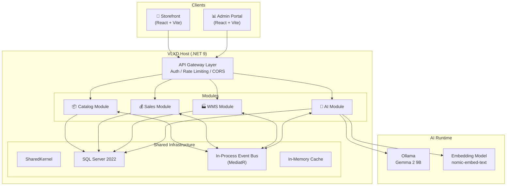
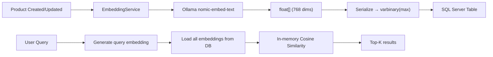

# VLXD Smart System — Implementation Plan

## Tổng quan

Xây dựng hệ thống quản lý và bán vật liệu xây dựng (VLXD) thông minh, tích hợp AI tư vấn, với kiến trúc **Modular Monolith** trên **.NET 9**, frontend **React + Vite**, database **SQL Server**, và AI chạy local qua **Ollama**.

### Quyết định đã chốt

| Hạng mục | Quyết định |
|---|---|
| Kiến trúc | Modular Monolith — 1 host, nhiều module tách biệt |
| Backend | .NET 9 Minimal APIs |
| Frontend | React 19 + Vite (2 apps: Storefront + Admin Portal) |
| Database | **SQL Server 2022** (Developer Edition, free) |
| Vector Search | **In-memory cosine similarity** (embeddings lưu `varbinary(max)` trong SQL Server, tính similarity trong C#) |
| Fuzzy Search | **SQL Server Full-Text Search** + Levenshtein in C# + Product Aliases table |
| AI Runtime | Ollama local (Gemma 2 9B), NuGet: `OllamaSharp` |
| AI Abstraction | Microsoft.Extensions.AI 9.x (`IChatClient`, `IEmbeddingGenerator`) |
| Embedding Model | `nomic-embed-text` (768 dimensions) |
| Frontend UI | Tailwind CSS + Shadcn/ui |
| Tích hợp ngoài | Interface + Mock Adapters (Zalo OA, GHTK, Payment) |
| Auth | ASP.NET Core Identity + JWT (3 seeded accounts, no email flows) |

> [!NOTE]
> **Tại sao SQL Server thay vì PostgreSQL?** User yêu cầu đổi sang SQL Server. Hệ quả:
> - Không có `pgvector` → dùng **in-memory vector search** (load embeddings vào RAM, tính cosine similarity trong C#). Với ~30-1000 sản phẩm, tốc độ vẫn ở mức micro-giây.
> - Không có `pg_trgm` → dùng **SQL Server Full-Text Search** + **Levenshtein distance** trong C# + **Product Aliases** table.
> - Schema separation vẫn hoạt động tốt (SQL Server hỗ trợ schemas native).

---

## Kiến trúc Tổng thể



---

## Solution Structure

```
speedrunapp/
├── src/
│   ├── VLXD.Host/                              # ASP.NET Core host — entry point
│   │   ├── Program.cs                          # DI registration, middleware, module wiring
│   │   ├── appsettings.json                    # Connection strings, Ollama config
│   │   └── VLXD.Host.csproj
│   │
│   ├── VLXD.SharedKernel/                      # Shared abstractions & base classes
│   │   ├── Domain/
│   │   │   ├── Entity.cs                       # Base entity with Id, CreatedAt, UpdatedAt
│   │   │   ├── AggregateRoot.cs                # Base aggregate root
│   │   │   ├── IDomainEvent.cs                 # Domain event interface
│   │   │   └── Result.cs                       # Result pattern (Success/Failure)
│   │   ├── Application/
│   │   │   ├── IUnitOfWork.cs
│   │   │   └── PagedResult.cs                  # Pagination DTO
│   │   ├── Infrastructure/
│   │   │   └── IExternalServiceAdapter.cs      # Port for external integrations
│   │   └── VLXD.SharedKernel.csproj
│   │
│   ├── Modules/
│   │   ├── VLXD.Modules.Catalog/               # 📦 Product Catalog & Categories
│   │   │   ├── Domain/
│   │   │   │   ├── Entities/
│   │   │   │   │   ├── Product.cs              # SKU, name, specs, price, wastage rate
│   │   │   │   │   ├── Category.cs             # Hierarchical categories
│   │   │   │   │   ├── ProductSpec.cs           # Key-value technical specs
│   │   │   │   │   ├── PriceTier.cs            # B2C/B2B/Dealer pricing
│   │   │   │   │   └── ProductAlias.cs         # Synonym/alias for fuzzy matching
│   │   │   │   └── Events/
│   │   │   │       └── ProductCreatedEvent.cs  # Triggers embedding generation
│   │   │   ├── Application/
│   │   │   │   ├── Commands/
│   │   │   │   │   ├── CreateProduct/
│   │   │   │   │   ├── UpdateProduct/
│   │   │   │   │   └── DeleteProduct/
│   │   │   │   ├── Queries/
│   │   │   │   │   ├── GetProducts/
│   │   │   │   │   ├── GetProductById/
│   │   │   │   │   ├── SearchProducts/         # Full-text + fuzzy search
│   │   │   │   │   └── GetCategories/
│   │   │   │   └── DTOs/
│   │   │   ├── Infrastructure/
│   │   │   │   ├── CatalogDbContext.cs          # Module-specific DbContext
│   │   │   │   ├── Configurations/             # EF Core entity configs
│   │   │   │   └── Repositories/
│   │   │   ├── Api/
│   │   │   │   └── CatalogEndpoints.cs         # Minimal API endpoints
│   │   │   └── CatalogModule.cs                # Module registration (IServiceCollection)
│   │   │
│   │   ├── VLXD.Modules.Sales/                 # 💰 Orders, Quotations, Pricing
│   │   │   ├── Domain/
│   │   │   │   ├── Entities/
│   │   │   │   │   ├── Order.cs                # Order aggregate root
│   │   │   │   │   ├── OrderItem.cs
│   │   │   │   │   ├── Quotation.cs            # Draft quotation from AI extraction
│   │   │   │   │   ├── QuotationItem.cs
│   │   │   │   │   └── Customer.cs             # Customer with tier (B2C/B2B/Dealer)
│   │   │   │   ├── Enums/
│   │   │   │   │   ├── OrderStatus.cs          # Draft→Confirmed→Delivering→Completed
│   │   │   │   │   └── CustomerTier.cs         # Retail, Contractor, Dealer
│   │   │   │   └── Events/
│   │   │   │       ├── OrderPlacedEvent.cs      # Triggers inventory reservation
│   │   │   │       └── QuotationCreatedEvent.cs
│   │   │   ├── Application/
│   │   │   │   ├── Commands/
│   │   │   │   │   ├── PlaceOrder/
│   │   │   │   │   ├── CreateQuotation/        # From AI entity extraction
│   │   │   │   │   ├── ApproveQuotation/       # Employee approves → Order
│   │   │   │   │   └── UpdateOrderStatus/
│   │   │   │   ├── Queries/
│   │   │   │   │   ├── GetOrders/
│   │   │   │   │   ├── GetQuotations/
│   │   │   │   │   └── GetDashboardStats/      # Revenue, order count
│   │   │   │   └── DTOs/
│   │   │   ├── Infrastructure/
│   │   │   │   ├── SalesDbContext.cs
│   │   │   │   └── Repositories/
│   │   │   ├── Api/
│   │   │   │   └── SalesEndpoints.cs
│   │   │   └── SalesModule.cs
│   │   │
│   │   ├── VLXD.Modules.WMS/                   # 🏭 Warehouse & Delivery
│   │   │   ├── Domain/
│   │   │   │   ├── Entities/
│   │   │   │   │   ├── Warehouse.cs            # Multiple warehouses/yards
│   │   │   │   │   ├── InventoryItem.cs        # Stock per product per warehouse
│   │   │   │   │   ├── StockMovement.cs        # In/Out/Transfer records
│   │   │   │   │   ├── DeliveryOrder.cs        # Delivery tracking
│   │   │   │   │   └── Vehicle.cs              # Truck tracking (mock GPS)
│   │   │   │   ├── Enums/
│   │   │   │   │   ├── MovementType.cs         # Inbound, Outbound, Transfer
│   │   │   │   │   ├── DeliveryStatus.cs       # Pending→InTransit→Delivered
│   │   │   │   │   └── UnitOfMeasure.cs        # Thùng, Bao, Khối(m³), Cây, Viên
│   │   │   │   └── Events/
│   │   │   │       ├── StockReservedEvent.cs
│   │   │   │       └── DeliveryStatusChangedEvent.cs
│   │   │   ├── Application/
│   │   │   │   ├── Commands/
│   │   │   │   │   ├── ReceiveStock/           # Nhập kho
│   │   │   │   │   ├── ReserveStock/           # Giữ hàng cho đơn
│   │   │   │   │   ├── CreateDelivery/
│   │   │   │   │   └── UpdateDeliveryStatus/
│   │   │   │   ├── Queries/
│   │   │   │   │   ├── GetInventory/
│   │   │   │   │   ├── GetDeliveryStatus/      # For AI to check delivery
│   │   │   │   │   └── GetLowStockAlerts/
│   │   │   │   └── DTOs/
│   │   │   ├── Infrastructure/
│   │   │   │   ├── WmsDbContext.cs
│   │   │   │   ├── Repositories/
│   │   │   │   └── MockAdapters/
│   │   │   │       ├── MockDeliveryTracker.cs  # Fake GPS/delivery tracking
│   │   │   │       └── MockSmsNotifier.cs      # Fake SMS notifications
│   │   │   ├── Api/
│   │   │   │   └── WmsEndpoints.cs
│   │   │   └── WmsModule.cs
│   │   │
│   │   └── VLXD.Modules.AI/                    # 🤖 AI Services
│   │       ├── Domain/
│   │       │   ├── Entities/
│   │       │   │   ├── ChatSession.cs          # Chat history per customer
│   │       │   │   ├── ChatMessage.cs          # Individual messages
│   │       │   │   ├── ProductEmbedding.cs     # Vector embeddings (varbinary)
│   │       │   │   └── SupportTicket.cs        # Escalated tickets
│   │       │   └── Enums/
│   │       │       ├── SentimentLevel.cs       # Positive, Neutral, Negative
│   │       │       └── TicketPriority.cs       # Low, Medium, High, Urgent
│   │       ├── Application/
│   │       │   ├── Services/
│   │       │   │   ├── ChatOrchestrator.cs     # Main chat flow coordinator
│   │       │   │   ├── RagService.cs           # RAG: retrieve context + generate
│   │       │   │   ├── EntityExtractionService.cs  # Parse quotation requests
│   │       │   │   ├── SentimentAnalyzer.cs    # Sentiment classification
│   │       │   │   ├── MaterialCalculator.cs   # Tính toán vật tư + hao hụt
│   │       │   │   ├── EmbeddingService.cs     # Generate & store embeddings
│   │       │   │   ├── LlmJsonSanitizer.cs     # Clean markdown-wrapped JSON from LLM
│   │       │   │   └── VectorSearchService.cs  # In-memory cosine similarity search
│   │       │   ├── Prompts/                    # System prompt templates
│   │       │   │   ├── ConsultantPrompt.txt    # Tư vấn viên VLXD
│   │       │   │   ├── ExtractionPrompt.txt    # Entity extraction format
│   │       │   │   └── SentimentPrompt.txt     # Sentiment classification
│   │       │   └── DTOs/
│   │       │       ├── ChatRequest.cs
│   │       │       ├── ChatResponse.cs
│   │       │       ├── ExtractedEntity.cs      # {Quantity, Unit, ItemName, Confidence}
│   │       │       └── SentimentResult.cs
│   │       ├── Infrastructure/
│   │       │   ├── AiDbContext.cs
│   │       │   ├── Configurations/
│   │       │   │   └── ProductEmbeddingConfig.cs  # varbinary(max) column mapping
│   │       │   └── Repositories/
│   │       ├── Api/
│   │       │   └── AiEndpoints.cs
│   │       └── AiModule.cs
│   │
│   └── Clients/
│       ├── storefront/                         # 🛒 B2C/B2B Customer Website
│       │   ├── public/
│       │   ├── src/
│       │   │   ├── api/                        # API client (axios/fetch wrapper)
│       │   │   ├── components/
│       │   │   │   ├── layout/                 # Header, Footer, Sidebar
│       │   │   │   ├── product/                # ProductCard, ProductGrid, ProductDetail
│       │   │   │   ├── cart/                   # Cart, CartItem
│       │   │   │   ├── chat/                   # AIChatWidget, ChatBubble, ChatInput
│       │   │   │   └── common/                 # Button, Input, Modal, Loading
│       │   │   ├── pages/
│       │   │   │   ├── HomePage.jsx
│       │   │   │   ├── ProductListPage.jsx
│       │   │   │   ├── ProductDetailPage.jsx
│       │   │   │   ├── CartPage.jsx
│       │   │   │   ├── CheckoutPage.jsx
│       │   │   │   └── OrderTrackingPage.jsx
│       │   │   ├── hooks/                      # Custom hooks (useProducts, useChat)
│       │   │   ├── store/                      # State management (Zustand)
│       │   │   ├── styles/                     # Global CSS, design tokens
│       │   │   ├── App.jsx
│       │   │   └── main.jsx
│       │   ├── index.html
│       │   ├── vite.config.js
│       │   └── package.json
│       │
│       └── admin-portal/                       # 📊 Management Portal
│           ├── src/
│           │   ├── api/
│           │   ├── components/
│           │   │   ├── layout/                 # AdminSidebar, TopBar
│           │   │   ├── dashboard/              # StatCards, Charts
│           │   │   ├── orders/                 # OrderTable, OrderDetail
│           │   │   ├── inventory/              # StockTable, StockMovementForm
│           │   │   ├── quotations/             # QuotationReview, QuotationDiff
│           │   │   ├── tickets/                # TicketList, TicketDetail (AI escalated)
│           │   │   └── common/
│           │   ├── pages/
│           │   │   ├── DashboardPage.jsx
│           │   │   ├── OrdersPage.jsx
│           │   │   ├── InventoryPage.jsx
│           │   │   ├── QuotationsPage.jsx       # AI-generated quotation drafts
│           │   │   ├── TicketsPage.jsx           # AI-escalated support tickets
│           │   │   ├── ProductManagementPage.jsx
│           │   │   └── DeliveryTrackingPage.jsx
│           │   ├── hooks/
│           │   ├── store/
│           │   ├── styles/
│           │   ├── App.jsx
│           │   └── main.jsx
│           ├── vite.config.js
│           └── package.json
│
├── tests/
│   ├── VLXD.Modules.Catalog.Tests/
│   ├── VLXD.Modules.Sales.Tests/
│   ├── VLXD.Modules.WMS.Tests/
│   └── VLXD.Modules.AI.Tests/
│
├── VLXD.sln
├── docker-compose.yml                          # SQL Server 2022
├── .gitignore
└── README.md
```

---

## Database Design (SQL Server 2022)

Dùng **1 SQL Server instance** với **schema tách biệt** cho mỗi module.

### Vector Search Strategy (thay thế pgvector)



> [!TIP]
> Với ~30-1000 sản phẩm, in-memory cosine similarity chạy ở mức **micro-giây**. Không cần vector DB riêng. Dùng `IMemoryCache` để cache embeddings, chỉ reload khi có product thay đổi.

### Schema Layout

```mermaid
erDiagram
    %% ═══ CATALOG SCHEMA ═══
    catalog_products {
        uniqueidentifier id PK
        nvarchar_50 sku UK
        nvarchar_200 name
        nvarchar_max description
        uniqueidentifier category_id FK
        decimal_18_2 base_price
        nvarchar_20 unit_of_measure
        decimal_18_4 units_per_package
        decimal_18_4 coverage_per_package
        decimal_5_2 wastage_rate
        nvarchar_500 image_url
        bit is_active
        datetime2 created_at
        datetime2 updated_at
    }

    catalog_categories {
        uniqueidentifier id PK
        nvarchar_100 name
        uniqueidentifier parent_id FK
        int sort_order
    }

    catalog_product_specs {
        uniqueidentifier id PK
        uniqueidentifier product_id FK
        nvarchar_100 spec_key
        nvarchar_200 spec_value
    }

    catalog_product_aliases {
        uniqueidentifier id PK
        uniqueidentifier product_id FK
        nvarchar_200 alias_name
    }

    catalog_price_tiers {
        uniqueidentifier id PK
        uniqueidentifier product_id FK
        nvarchar_50 tier_name
        decimal_18_2 price
        int min_quantity
    }

    catalog_categories ||--o{ catalog_products : contains
    catalog_products ||--o{ catalog_product_specs : has
    catalog_products ||--o{ catalog_product_aliases : has
    catalog_products ||--o{ catalog_price_tiers : has

    %% ═══ SALES SCHEMA ═══
    sales_customers {
        uniqueidentifier id PK
        nvarchar_200 name
        nvarchar_20 phone UK
        nvarchar_200 email
        nvarchar_500 address
        nvarchar_20 tier
        datetime2 created_at
    }

    sales_orders {
        uniqueidentifier id PK
        uniqueidentifier customer_id FK
        nvarchar_20 order_number UK
        nvarchar_20 status
        decimal_18_2 total_amount
        nvarchar_500 delivery_address
        nvarchar_max notes
        datetime2 created_at
        datetime2 updated_at
    }

    sales_order_items {
        uniqueidentifier id PK
        uniqueidentifier order_id FK
        uniqueidentifier product_id
        nvarchar_200 product_name
        int quantity
        nvarchar_20 unit
        decimal_18_2 unit_price
        decimal_18_2 subtotal
    }

    sales_quotations {
        uniqueidentifier id PK
        uniqueidentifier customer_id FK
        nvarchar_max source_text
        nvarchar_20 status
        decimal_18_2 total_estimated
        bit created_by_ai
        datetime2 created_at
    }

    sales_quotation_items {
        uniqueidentifier id PK
        uniqueidentifier quotation_id FK
        uniqueidentifier matched_product_id
        nvarchar_500 raw_item_text
        int quantity
        nvarchar_20 unit
        decimal_18_2 unit_price
        decimal_5_2 confidence_score
    }

    sales_customers ||--o{ sales_orders : places
    sales_orders ||--o{ sales_order_items : contains
    sales_customers ||--o{ sales_quotations : has
    sales_quotations ||--o{ sales_quotation_items : contains

    %% ═══ WMS SCHEMA ═══
    wms_warehouses {
        uniqueidentifier id PK
        nvarchar_200 name
        nvarchar_500 address
    }

    wms_inventory {
        uniqueidentifier id PK
        uniqueidentifier warehouse_id FK
        uniqueidentifier product_id
        decimal_18_4 quantity_on_hand
        decimal_18_4 quantity_reserved
        nvarchar_50 bin_location
        datetime2 last_updated
    }

    wms_stock_movements {
        uniqueidentifier id PK
        uniqueidentifier warehouse_id FK
        uniqueidentifier product_id
        nvarchar_20 movement_type
        decimal_18_4 quantity
        nvarchar_50 reference_number
        nvarchar_max notes
        datetime2 created_at
    }

    wms_delivery_orders {
        uniqueidentifier id PK
        uniqueidentifier order_id
        uniqueidentifier vehicle_id FK
        nvarchar_20 status
        nvarchar_500 delivery_address
        datetime2 estimated_arrival
        datetime2 actual_arrival
        nvarchar_max notes
        datetime2 created_at
    }

    wms_vehicles {
        uniqueidentifier id PK
        nvarchar_20 plate_number
        nvarchar_100 driver_name
        nvarchar_20 driver_phone
        float current_lat
        float current_lng
        nvarchar_20 current_status
    }

    wms_warehouses ||--o{ wms_inventory : stores
    wms_warehouses ||--o{ wms_stock_movements : records
    wms_vehicles ||--o{ wms_delivery_orders : assigned

    %% ═══ AI SCHEMA ═══
    ai_chat_sessions {
        uniqueidentifier id PK
        uniqueidentifier customer_id
        nvarchar_20 channel
        datetime2 started_at
        datetime2 last_message_at
    }

    ai_chat_messages {
        uniqueidentifier id PK
        uniqueidentifier session_id FK
        nvarchar_20 role
        nvarchar_max content
        nvarchar_20 sentiment
        datetime2 created_at
    }

    ai_product_embeddings {
        uniqueidentifier id PK
        uniqueidentifier product_id UK
        nvarchar_max content_text
        varbinary_max embedding "float[] serialized"
        datetime2 created_at
    }

    ai_support_tickets {
        uniqueidentifier id PK
        uniqueidentifier session_id FK
        uniqueidentifier customer_id
        nvarchar_20 priority
        nvarchar_20 status
        nvarchar_500 summary
        uniqueidentifier assigned_to
        datetime2 created_at
        datetime2 resolved_at
    }

    ai_chat_sessions ||--o{ ai_chat_messages : contains
    ai_chat_sessions ||--o{ ai_support_tickets : escalates
```



---

## API Design

### Catalog Module

| Method | Endpoint | Mô tả |
|---|---|---|
| GET | `/api/catalog/products` | Danh sách sản phẩm (paginated, filterable) |
| GET | `/api/catalog/products/{id}` | Chi tiết sản phẩm |
| GET | `/api/catalog/products/search?q=` | Full-text + fuzzy search |
| GET | `/api/catalog/categories` | Danh mục phân cấp |
| POST | `/api/catalog/products` | Tạo sản phẩm (Admin) |
| PUT | `/api/catalog/products/{id}` | Cập nhật sản phẩm (Admin) |
| DELETE | `/api/catalog/products/{id}` | Xóa sản phẩm (Admin) |

### Sales Module

| Method | Endpoint | Mô tả |
|---|---|---|
| POST | `/api/sales/orders` | Đặt hàng |
| GET | `/api/sales/orders` | Danh sách đơn hàng |
| GET | `/api/sales/orders/{id}` | Chi tiết đơn hàng |
| PUT | `/api/sales/orders/{id}/status` | Cập nhật trạng thái |
| GET | `/api/sales/quotations` | Danh sách báo giá (AI-generated) |
| POST | `/api/sales/quotations/{id}/approve` | Duyệt báo giá → tạo đơn |
| GET | `/api/sales/customers` | Danh sách khách hàng |
| GET | `/api/sales/dashboard` | Thống kê doanh thu |

### WMS Module

| Method | Endpoint | Mô tả |
|---|---|---|
| GET | `/api/wms/inventory` | Tồn kho hiện tại |
| POST | `/api/wms/inventory/receive` | Nhập kho |
| GET | `/api/wms/inventory/low-stock` | Cảnh báo sắp hết hàng |
| GET | `/api/wms/deliveries` | Danh sách giao hàng |
| GET | `/api/wms/deliveries/{id}` | Trạng thái giao hàng (cho AI query) |
| PUT | `/api/wms/deliveries/{id}/status` | Cập nhật trạng thái giao hàng |
| GET | `/api/wms/vehicles` | Danh sách xe tải |

### AI Module

| Method | Endpoint | Mô tả |
|---|---|---|
| POST | `/api/ai/chat` | Gửi tin nhắn → AI trả lời (streaming) |
| GET | `/api/ai/chat/sessions` | Lịch sử chat sessions |
| POST | `/api/ai/extract-quotation` | Parse text → entities → draft quotation |
| GET | `/api/ai/tickets` | Support tickets (escalated) |
| PUT | `/api/ai/tickets/{id}` | Cập nhật ticket |
| POST | `/api/ai/embeddings/rebuild` | Rebuild product embeddings (Admin) |

---

## Tech Stack Summary

| Layer | Package/Tool | Version |
|---|---|---|
| **Runtime** | .NET | 9.0 |
| **Web Framework** | ASP.NET Core Minimal APIs | 9.0 |
| **ORM** | Entity Framework Core | 9.0 |
| **Database** | **SQL Server 2022** (Developer Edition) | 2022 |
| **EF Core Provider** | **Microsoft.EntityFrameworkCore.SqlServer** | 9.x |
| **Vector Search** | In-memory cosine similarity (C#) | — |
| **Fuzzy Search** | SQL Server Full-Text Search + Levenshtein | — |
| **CQRS/Mediator** | MediatR | 12.x |
| **Validation** | FluentValidation | 11.x |
| **AI Abstraction** | Microsoft.Extensions.AI | 9.4+ |
| **Ollama .NET Client** | OllamaSharp (implements IChatClient) | 5.x |
| **AI Runtime** | Ollama (local) | latest |
| **AI Model (Chat)** | Gemma 2 9B | latest |
| **AI Model (Embed)** | nomic-embed-text | latest |
| **Auth** | ASP.NET Core Identity + JWT | 9.0 |
| **Frontend** | React | 19.x |
| **Build Tool** | Vite | 6.x |
| **CSS Framework** | Tailwind CSS | 4.x |
| **UI Components** | Shadcn/ui + Radix UI | latest |
| **Routing** | React Router | 7.x |
| **State** | Zustand | 5.x |
| **HTTP Client** | Axios | 1.x |
| **Charts** | Recharts | 2.x |
| **Container** | Docker Compose | 2.x |

---

## Decisions Resolved ✅

| Câu hỏi | Quyết định |
|---|---|
| **Database** | SQL Server 2022 Developer Edition (free, chạy Docker hoặc local) |
| **Timeline** | 4 phases × 2 tuần = ~8 tuần. Phase 1 ưu tiên Backend Core. |
| **Auth** | Giữ Identity + JWT. Seed 3 accounts mặc định. Không email flows. |
| **Seed data** | DbSeeder.cs tự động, phủ edge-cases (wastage, m³, aliases). |
| **Frontend UI** | Tailwind CSS + Shadcn/ui. MVP-level ở Phase 1-3, polish ở Phase 4. |
| **Vector Search** | In-memory cosine similarity, cache embeddings với IMemoryCache. |
| **JSON Sanitization** | LlmJsonSanitizer.cs strip markdown fences trước deserialize. |

### Seeded Accounts (DbSeeder)

| Role | Email | Password | Mô tả |
|---|---|---|---|
| Admin | `admin@vlxd.local` | `Admin@123` | Full access |
| Employee | `sale@vlxd.local` | `Sale@123` | Quản lý đơn hàng, duyệt báo giá |
| Customer | `khach@vlxd.local` | `Khach@123` | Đặt hàng, chat AI |

---
---

# PHASE WORKFLOWS — Chi tiết từng bước

---

## 🔷 PHASE 1 — Foundation & Catalog (Tuần 1-2)

> **Mục tiêu**: Dựng skeleton Modular Monolith thật kỹ, Catalog CRUD hoàn chỉnh, Auth + Seed, Frontend MVP-level.

---

### Step 1.1 — Khởi tạo Solution & Project Structure

**Công việc:** Tạo .NET Solution, tất cả class library projects, và Host project.

**Commands:**
```bash
# Tạo solution
dotnet new sln -n VLXD -o .

# Host project
dotnet new web -n VLXD.Host -o src/VLXD.Host

# SharedKernel
dotnet new classlib -n VLXD.SharedKernel -o src/VLXD.SharedKernel

# Modules
dotnet new classlib -n VLXD.Modules.Catalog -o src/Modules/VLXD.Modules.Catalog
dotnet new classlib -n VLXD.Modules.Sales -o src/Modules/VLXD.Modules.Sales
dotnet new classlib -n VLXD.Modules.WMS -o src/Modules/VLXD.Modules.WMS
dotnet new classlib -n VLXD.Modules.AI -o src/Modules/VLXD.Modules.AI

# Test projects
dotnet new xunit -n VLXD.Modules.Catalog.Tests -o tests/VLXD.Modules.Catalog.Tests
dotnet new xunit -n VLXD.Modules.Sales.Tests -o tests/VLXD.Modules.Sales.Tests
dotnet new xunit -n VLXD.Modules.WMS.Tests -o tests/VLXD.Modules.WMS.Tests
dotnet new xunit -n VLXD.Modules.AI.Tests -o tests/VLXD.Modules.AI.Tests

# Add all to solution
dotnet sln add src/VLXD.Host
dotnet sln add src/VLXD.SharedKernel
dotnet sln add src/Modules/VLXD.Modules.Catalog
dotnet sln add src/Modules/VLXD.Modules.Sales
dotnet sln add src/Modules/VLXD.Modules.WMS
dotnet sln add src/Modules/VLXD.Modules.AI
dotnet sln add tests/VLXD.Modules.Catalog.Tests
# ... (tương tự cho tests còn lại)
```

**Project References:**
```
VLXD.Host → references tất cả Modules + SharedKernel
VLXD.Modules.Catalog → references SharedKernel
VLXD.Modules.Sales → references SharedKernel
VLXD.Modules.WMS → references SharedKernel
VLXD.Modules.AI → references SharedKernel
```

**NuGet Packages cần install (Phase 1):**

| Project | Package |
|---|---|
| `VLXD.Host` | `Microsoft.AspNetCore.Authentication.JwtBearer`, `Microsoft.AspNetCore.Identity.EntityFrameworkCore`, `MediatR` |
| `VLXD.SharedKernel` | `MediatR.Contracts` |
| `VLXD.Modules.Catalog` | `Microsoft.EntityFrameworkCore.SqlServer`, `Microsoft.EntityFrameworkCore.Design`, `FluentValidation`, `MediatR` |

**Files tạo mới:**
- `src/VLXD.Host/VLXD.Host.csproj` — project file
- `src/VLXD.SharedKernel/VLXD.SharedKernel.csproj` — project file
- `src/Modules/VLXD.Modules.Catalog/VLXD.Modules.Catalog.csproj` — project file
- `.gitignore` — .NET template
- `docker-compose.yml` — SQL Server container

**✅ Verification Checklist:**
- [ ] `dotnet build` thành công, 0 errors
- [ ] Solution có đủ 7 projects (1 Host + 1 SharedKernel + 4 Modules + ít nhất 1 Test)
- [ ] Project references đúng (Host → Modules → SharedKernel)
- [ ] Không có circular reference

---

### Step 1.2 — SharedKernel: Base Classes

**Công việc:** Tạo các abstractions dùng chung: Entity, AggregateRoot, Result pattern, IDomainEvent, PagedResult.

**Files tạo mới:**

| File | Nội dung |
|---|---|
| `src/VLXD.SharedKernel/Domain/Entity.cs` | Base class: `Id` (Guid), `CreatedAt`, `UpdatedAt`. Override `Equals` và `GetHashCode` theo `Id`. |
| `src/VLXD.SharedKernel/Domain/AggregateRoot.cs` | Kế thừa Entity, có `List<IDomainEvent> DomainEvents`. Methods: `AddDomainEvent()`, `ClearDomainEvents()`. |
| `src/VLXD.SharedKernel/Domain/IDomainEvent.cs` | Interface kế thừa `MediatR.INotification`. |
| `src/VLXD.SharedKernel/Domain/Result.cs` | Generic Result pattern: `Result<T>` với `IsSuccess`, `Value`, `Error`. Static factories: `Result.Success(value)`, `Result.Failure(error)`. |
| `src/VLXD.SharedKernel/Application/IUnitOfWork.cs` | Interface: `Task<int> SaveChangesAsync(CancellationToken ct)`. |
| `src/VLXD.SharedKernel/Application/PagedResult.cs` | Record: `Items`, `TotalCount`, `Page`, `PageSize`, `TotalPages`. |
| `src/VLXD.SharedKernel/Infrastructure/IExternalServiceAdapter.cs` | Marker interface cho mock adapters. |

**✅ Verification Checklist:**
- [ ] `dotnet build` thành công
- [ ] `Entity.cs` có `Id`, `CreatedAt`, `UpdatedAt`, proper `Equals`/`GetHashCode`
- [ ] `AggregateRoot.cs` có domain events collection
- [ ] `Result.cs` có `Success()` và `Failure()` factories
- [ ] `PagedResult.cs` tính `TotalPages` đúng (ceiling division)

---

### Step 1.3 — Docker Compose: SQL Server

**Công việc:** Setup Docker Compose file với SQL Server 2022 Developer Edition.

**File tạo mới: `docker-compose.yml`**

```yaml
services:
  sqlserver:
    image: mcr.microsoft.com/mssql/server:2022-latest
    environment:
      ACCEPT_EULA: "Y"
      MSSQL_SA_PASSWORD: "VlxdDev@2024"
      MSSQL_PID: "Developer"
    ports:
      - "1433:1433"
    volumes:
      - sqlserver_data:/var/opt/mssql

volumes:
  sqlserver_data:
```

**File cập nhật: `src/VLXD.Host/appsettings.json`**

```json
{
  "ConnectionStrings": {
    "DefaultConnection": "Server=localhost,1433;Database=VlxdDb;User Id=sa;Password=VlxdDev@2024;TrustServerCertificate=true;"
  }
}
```

**✅ Verification Checklist:**
- [ ] `docker-compose up -d` khởi động thành công
- [ ] Kết nối được SQL Server bằng SSMS hoặc Azure Data Studio tại `localhost,1433`
- [ ] Login bằng `sa` / `VlxdDev@2024` thành công

---

### Step 1.4 — Catalog Module: Domain Entities

**Công việc:** Tạo tất cả domain entities cho Catalog module. Mỗi entity phải kế thừa `Entity` từ SharedKernel.

**Files tạo mới:**

| File | Nội dung chi tiết |
|---|---|
| `Domain/Entities/Category.cs` | Props: `Name` (string), `ParentId` (Guid?), `SortOrder` (int), `Parent` (Category?), `Children` (ICollection), `Products` (ICollection). |
| `Domain/Entities/Product.cs` | Props: `Sku` (string, unique), `Name`, `Description`, `CategoryId` (Guid), `BasePrice` (decimal), `UnitOfMeasure` (string), `UnitsPerPackage` (decimal?), `CoveragePerPackage` (decimal? — m² per package), `WastageRate` (decimal — 0.05 = 5%), `ImageUrl` (string?), `IsActive` (bool). Navigation: `Category`, `Specs`, `Aliases`, `PriceTiers`. |
| `Domain/Entities/ProductSpec.cs` | Props: `ProductId` (Guid), `SpecKey` (string), `SpecValue` (string). Navigation: `Product`. |
| `Domain/Entities/ProductAlias.cs` | Props: `ProductId` (Guid), `AliasName` (string — e.g. "xi HT", "ximang hatien"). Navigation: `Product`. |
| `Domain/Entities/PriceTier.cs` | Props: `ProductId` (Guid), `TierName` (string — "Retail"/"Contractor"/"Dealer"), `Price` (decimal), `MinQuantity` (int). Navigation: `Product`. |
| `Domain/Events/ProductCreatedEvent.cs` | Record implementing `IDomainEvent`: `ProductId` (Guid). Sẽ trigger embedding generation ở Phase 3. |

**Quy tắc domain:**
- Product.Sku phải unique, format: `VLXD-XXXX`
- WastageRate: giá trị 0.00 - 1.00 (0% - 100%)
- CoveragePerPackage: chỉ có ý nghĩa với sản phẩm tính diện tích (gạch, sơn)
- UnitsPerPackage: null nếu sản phẩm bán theo khối (cát, đá)

**✅ Verification Checklist:**
- [ ] `dotnet build` thành công
- [ ] Mỗi entity kế thừa `Entity` (có Id, CreatedAt, UpdatedAt)
- [ ] Product có navigation props đến Specs, Aliases, PriceTiers
- [ ] Category có self-referencing relationship (Parent/Children)
- [ ] ProductCreatedEvent implements `IDomainEvent`

---

### Step 1.5 — Catalog Module: DbContext & EF Core Configuration

**Công việc:** Tạo CatalogDbContext với schema "catalog", entity configurations, và initial migration.

**Files tạo mới:**

| File | Nội dung chi tiết |
|---|---|
| `Infrastructure/CatalogDbContext.cs` | `DbSet<Product>`, `DbSet<Category>`, etc. `OnModelCreating`: `modelBuilder.HasDefaultSchema("catalog")`. Implement `IUnitOfWork`. |
| `Infrastructure/Configurations/ProductConfiguration.cs` | `IEntityTypeConfiguration<Product>`. Configure: `Sku` max 50 + unique index, `Name` max 200 required, `Description` nvarchar(max), `BasePrice` precision(18,2), `WastageRate` precision(5,2). Relationships: HasMany(Specs/Aliases/PriceTiers).WithOne(Product). |
| `Infrastructure/Configurations/CategoryConfiguration.cs` | Self-referencing: `HasOne(Parent).WithMany(Children).HasForeignKey(ParentId).OnDelete(Restrict)`. |
| `Infrastructure/Configurations/ProductSpecConfiguration.cs` | Composite index on (ProductId, SpecKey). |
| `Infrastructure/Configurations/ProductAliasConfiguration.cs` | Index on AliasName for search performance. |
| `Infrastructure/Configurations/PriceTierConfiguration.cs` | Composite index on (ProductId, TierName). |

**Commands:**
```bash
# Tạo migration (chạy từ root folder)
dotnet ef migrations add InitCatalog \
  --project src/Modules/VLXD.Modules.Catalog \
  --startup-project src/VLXD.Host \
  --context CatalogDbContext \
  --output-dir Infrastructure/Migrations

# Apply migration
dotnet ef database update \
  --project src/Modules/VLXD.Modules.Catalog \
  --startup-project src/VLXD.Host \
  --context CatalogDbContext
```

**✅ Verification Checklist:**
- [ ] Migration được tạo thành công
- [ ] `dotnet ef database update` chạy không lỗi
- [ ] Kiểm tra SQL Server: schema `catalog` đã được tạo
- [ ] Các bảng tồn tại: `catalog.Products`, `catalog.Categories`, `catalog.ProductSpecs`, `catalog.ProductAliases`, `catalog.PriceTiers`
- [ ] Sku có unique index
- [ ] Foreign keys đúng (Product → Category, Spec → Product, etc.)

---

### Step 1.6 — Catalog Module: CRUD API Endpoints

**Công việc:** Tạo Minimal API endpoints cho Catalog module. Dùng CQRS pattern nhẹ (không bắt buộc full MediatR handler cho mỗi query ở phase này, có thể dùng trực tiếp DbContext).

**Files tạo mới:**

| File | Nội dung chi tiết |
|---|---|
| `Application/DTOs/ProductDto.cs` | Record: Id, Sku, Name, Description, CategoryId, CategoryName, BasePrice, UnitOfMeasure, UnitsPerPackage, CoveragePerPackage, WastageRate, ImageUrl, IsActive, Specs (List), Aliases (List), PriceTiers (List). |
| `Application/DTOs/CategoryDto.cs` | Record: Id, Name, ParentId, SortOrder, Children (List). |
| `Application/DTOs/CreateProductRequest.cs` | Record: Sku, Name, Description, CategoryId, BasePrice, UnitOfMeasure, UnitsPerPackage?, CoveragePerPackage?, WastageRate, ImageUrl?, Specs (List), Aliases (List), PriceTiers (List). |
| `Application/DTOs/UpdateProductRequest.cs` | Tương tự CreateProductRequest. |
| `Api/CatalogEndpoints.cs` | Static class với extension method `MapCatalogEndpoints(this WebApplication app)`. Đăng ký tất cả routes dưới group `/api/catalog`. |
| `CatalogModule.cs` | Static class: `AddCatalogModule(this IServiceCollection services, IConfiguration config)` — register DbContext, repositories. |

**API Endpoints cụ thể trong `CatalogEndpoints.cs`:**

| Method | Route | Logic |
|---|---|---|
| `GET /api/catalog/products` | Query params: `page`, `pageSize`, `categoryId?`, `search?`, `isActive?`. Return `PagedResult<ProductDto>`. Include Category name via join. |
| `GET /api/catalog/products/{id}` | Return `ProductDto` with full Specs, Aliases, PriceTiers. Return 404 nếu không tìm thấy. |
| `GET /api/catalog/products/search?q=` | Full-text search trên Name, Description, Aliases. Return list ProductDto. |
| `GET /api/catalog/categories` | Return hierarchical list (parent → children). |
| `POST /api/catalog/products` | Validate input (FluentValidation), tạo Product + Specs + Aliases + PriceTiers. Return 201 + ProductDto. Require Admin role. |
| `PUT /api/catalog/products/{id}` | Update product + replace specs/aliases/tiers. Return 200 + ProductDto. Require Admin role. |
| `DELETE /api/catalog/products/{id}` | Soft delete (set IsActive = false). Return 204. Require Admin role. |

**File cập nhật: `src/VLXD.Host/Program.cs`**
- Register `builder.Services.AddCatalogModule(builder.Configuration)`
- Map `app.MapCatalogEndpoints()`
- Add CORS, Swagger/OpenAPI

**✅ Verification Checklist:**
- [ ] `dotnet build` thành công
- [ ] `dotnet run` khởi động host
- [ ] Swagger UI accessible tại `https://localhost:xxxx/swagger`
- [ ] `POST /api/catalog/products` tạo được sản phẩm → check DB có dữ liệu
- [ ] `GET /api/catalog/products` trả về danh sách (paginated)
- [ ] `GET /api/catalog/products/{id}` trả về đúng product với specs, aliases, price tiers
- [ ] `GET /api/catalog/products/search?q=gach` trả về kết quả search
- [ ] `PUT` cập nhật thành công, `DELETE` soft-delete thành công
- [ ] `GET /api/catalog/categories` trả về danh mục phân cấp

---

### Step 1.7 — Auth: ASP.NET Core Identity + JWT

**Công việc:** Setup Identity với JWT Bearer authentication. Tạo Auth endpoints (Login, Register). Phân quyền 3 roles.

**Files tạo mới:**

| File | Nội dung chi tiết |
|---|---|
| `src/VLXD.Host/Auth/ApplicationUser.cs` | Kế thừa `IdentityUser`. Thêm: `FullName` (string), `CustomerTier` (string?). |
| `src/VLXD.Host/Auth/ApplicationDbContext.cs` | Kế thừa `IdentityDbContext<ApplicationUser>`. Schema: "identity". |
| `src/VLXD.Host/Auth/AuthEndpoints.cs` | Endpoints: `POST /api/auth/login` (return JWT token), `POST /api/auth/register` (customer only). |
| `src/VLXD.Host/Auth/JwtSettings.cs` | Record: SecretKey, Issuer, Audience, ExpirationMinutes. |
| `src/VLXD.Host/Auth/TokenService.cs` | Generate JWT token với claims: UserId, Email, Role, FullName. |

**Roles:** `Admin`, `Employee`, `Customer`

**JWT Configuration trong `appsettings.json`:**
```json
{
  "JwtSettings": {
    "SecretKey": "VlxdSmartSystem2024SuperSecretKeyThatIsLongEnough!",
    "Issuer": "VLXD.Host",
    "Audience": "VLXD.Clients",
    "ExpirationMinutes": 1440
  }
}
```

**Program.cs additions:**
- `builder.Services.AddIdentity<ApplicationUser, IdentityRole>()`
- `builder.Services.AddAuthentication(JwtBearerDefaults.AuthenticationScheme)`
- `app.UseAuthentication()` + `app.UseAuthorization()`
- Apply `RequireAuthorization()` / `.RequireRole("Admin")` cho endpoints cần phân quyền

**✅ Verification Checklist:**
- [ ] Migration Identity tạo thành công, schema "identity" có tables: AspNetUsers, AspNetRoles, AspNetUserRoles
- [ ] `POST /api/auth/login` với credentials đúng → trả về JWT token
- [ ] `POST /api/auth/login` với credentials sai → 401
- [ ] Gọi `POST /api/catalog/products` **không có** Bearer token → 401
- [ ] Gọi `POST /api/catalog/products` **có** Bearer token (Admin) → 201/200
- [ ] Gọi `POST /api/catalog/products` **có** Bearer token (Customer) → 403 Forbidden
- [ ] `GET /api/catalog/products` (public) → 200 (không cần token)

---

### Step 1.8 — DbSeeder: Seed Accounts + Products

**Công việc:** Tạo `DbSeeder.cs` chạy khi ứng dụng startup. Seed 3 user accounts và ~30 sản phẩm VLXD thực tế phủ edge-cases.

**Files tạo mới:**

| File | Nội dung chi tiết |
|---|---|
| `src/VLXD.Host/Data/DbSeeder.cs` | Static class: `SeedAsync(IServiceProvider serviceProvider)`. Gọi `SeedRolesAsync()`, `SeedUsersAsync()`, `SeedCatalogAsync()`. |

**Seed Users:**

| Role | Email | Password | FullName |
|---|---|---|---|
| Admin | admin@vlxd.local | Admin@123 | Nguyễn Văn Admin |
| Employee | sale@vlxd.local | Sale@123 | Trần Thị Sale |
| Customer | khach@vlxd.local | Khach@123 | Lê Văn Khách |

**Seed Categories (6 danh mục):**
1. Gạch lát & Ốp
2. Xi măng & Vữa
3. Cát & Đá
4. Thép xây dựng
5. Ống nước & Phụ kiện
6. Sơn & Chống thấm

**Seed Products (~30 sản phẩm) — edge-cases phủ đầy đủ:**

| # | Category | Product | UoM | Pkg | Coverage | Wastage | Aliases |
|---|---|---|---|---|---|---|---|
| 1 | Gạch | Gạch Terrazzo 400x400 | Viên | 6 viên/thùng | 0.96 m²/thùng | 5% | "gach terrazzo", "gach 40", "terrazzo" |
| 2 | Gạch | Gạch men ốp tường 300x600 | Viên | 8 viên/thùng | 1.44 m²/thùng | 8% | "gach op tuong", "gach men" |
| 3 | Gạch | Gạch Mosaic thủy tinh 30x30 | Tấm | 11 tấm/thùng | 1.0 m²/thùng | 15% | "gach mosaic", "mosaic" |
| 4 | Gạch | Gạch granite 600x600 | Viên | 4 viên/thùng | 1.44 m²/thùng | 5% | "granite 60", "gach granite" |
| 5 | Gạch | Gạch bông xi măng 200x200 | Viên | 25 viên/thùng | 1.0 m²/thùng | 10% | "gach bong", "gach hoa van" |
| 6 | Xi măng | Xi măng Hà Tiên PCB40 | Bao | 1 bao = 50kg | null | 3% | "xi HT", "ximang hatien", "xm PCB40", "xi ha tien" |
| 7 | Xi măng | Xi măng Nghi Sơn PCB40 | Bao | 1 bao = 50kg | null | 3% | "xi NS", "xi nghi son" |
| 8 | Xi măng | Xi măng trắng Hà Tiên | Bao | 1 bao = 50kg | null | 5% | "xi trang", "xm trang" |
| 9 | Xi măng | Vữa khô trộn sẵn | Bao | 1 bao = 25kg | 1.2 m²/bao (dày 10mm) | 5% | "vua kho", "vua tron san" |
| 10 | Cát | Cát vàng xây dựng | Khối (m³) | null | null | 0% | "cat vang", "cat xay" |
| 11 | Cát | Cát san lấp | Khối (m³) | null | null | 0% | "cat san lap", "cat den" |
| 12 | Đá | Đá 1x2 xây dựng | Khối (m³) | null | null | 0% | "da 1x2", "da dam" |
| 13 | Đá | Đá 0x4 (đá mi) | Khối (m³) | null | null | 0% | "da 0x4", "da mi", "da mat" |
| 14 | Thép | Thép Pomina phi 10 | Cây | 1 cây = 11.7m | null | 3% | "thep P10", "thep pomina 10", "sat 10" |
| 15 | Thép | Thép Pomina phi 12 | Cây | 1 cây = 11.7m | null | 3% | "thep P12", "thep pomina 12", "sat 12" |
| 16 | Thép | Thép Pomina phi 16 | Cây | 1 cây = 11.7m | null | 3% | "thep P16", "sat 16" |
| 17 | Thép | Thép hình V (sắt V) 30x30 | Cây | 1 cây = 6m | null | 5% | "sat V", "thep V", "thep hinh V" |
| 18 | Thép | Lưới thép hàn B40 | Tấm | 1 tấm = 50x2m | null | 5% | "luoi B40", "luoi thep han" |
| 19 | Ống nước | Ống nhựa Bình Minh phi 21 | Cây | 1 cây = 4m | null | 2% | "ong BM 21", "ong binh minh 21" |
| 20 | Ống nước | Ống nhựa Bình Minh phi 27 | Cây | 1 cây = 4m | null | 2% | "ong BM 27", "ong binh minh 27", "ong BM phi 27" |
| 21 | Ống nước | Ống nhựa Bình Minh phi 34 | Cây | 1 cây = 4m | null | 2% | "ong BM 34" |
| 22 | Ống nước | Ống nhựa Tiền Phong phi 27 | Cây | 1 cây = 4m | null | 2% | "ong TP 27", "ong tien phong 27" |
| 23 | Ống nước | Co nhựa PVC 90° phi 27 | Cái | null | null | 5% | "co 27", "co pvc 27" |
| 24 | Ống nước | Tê nhựa PVC phi 27 | Cái | null | null | 5% | "te 27", "te pvc 27" |
| 25 | Sơn | Sơn nội thất Dulux InSpire | Thùng | 1 thùng = 18L | 12 m²/lít (2 lớp) | 10% | "son dulux", "dulux inspire" |
| 26 | Sơn | Sơn ngoại thất Dulux Weathershield | Thùng | 1 thùng = 18L | 10 m²/lít (2 lớp) | 10% | "son ngoai troi", "weathershield" |
| 27 | Sơn | Sơn lót Dulux | Thùng | 1 thùng = 18L | 14 m²/lít | 5% | "son lot", "dulux lot" |
| 28 | Sơn | Sơn chống thấm Flinkote | Thùng | 1 thùng = 20L | 0.8 m²/lít (3 lớp) | 10% | "chong tham", "flinkote" |
| 29 | Chống thấm | Keo chống thấm Sika | Thùng | 1 thùng = 25kg | 1.5 m²/kg (dày 1mm) | 5% | "sika", "keo sika", "chong tham sika" |
| 30 | Gạch | Gạch thẻ xây 8x18 | Viên | null | null | 5% | "gach the", "gach xay", "gach do" |

**Mỗi product cũng cần PriceTiers:**
```
Retail (B2C): base_price × 1.0
Contractor (B2B): base_price × 0.92 (giảm 8%)
Dealer: base_price × 0.85 (giảm 15%)
```

**Mỗi product cũng cần ProductSpecs (2-4 specs/product):**
- Gạch: `Kích thước`, `Bề mặt`, `Độ bền`, `Xuất xứ`
- Xi măng: `Loại`, `Cường độ`, `Thời gian ninh kết`, `Xuất xứ`
- Thép: `Tiêu chuẩn`, `Đường kính`, `Chiều dài`, `Xuất xứ`

**Gọi seeder trong Program.cs:**
```csharp
using (var scope = app.Services.CreateScope())
{
    await DbSeeder.SeedAsync(scope.ServiceProvider);
}
```

**✅ Verification Checklist:**
- [ ] Sau `dotnet run`, DB có 3 roles (Admin, Employee, Customer)
- [ ] DB có 3 users với đúng roles
- [ ] DB có 6+ categories với parent-child hierarchy
- [ ] DB có ~30 products
- [ ] Kiểm tra 1 product gạch: có `wastage_rate > 0`, `coverage_per_package > 0`
- [ ] Kiểm tra 1 product cát: `units_per_package = null`, `coverage_per_package = null`
- [ ] Kiểm tra xi măng HT: có ít nhất 4 aliases
- [ ] Kiểm tra mỗi product có 3 PriceTiers (Retail, Contractor, Dealer)
- [ ] Kiểm tra mỗi product có 2-4 ProductSpecs
- [ ] Chạy lại `dotnet run` lần 2 → KHÔNG duplicate data (seeder phải check trước khi insert)
- [ ] Login thành công cho cả 3 accounts

---

### Step 1.9 — Frontend: Khởi tạo Storefront (React + Vite + Tailwind + Shadcn/ui)

**Công việc:** Tạo Storefront project với Vite, cài Tailwind CSS v4, setup Shadcn/ui, tạo layout cơ bản.

**Commands:**
```bash
# Từ thư mục root
cd src/Clients

# Tạo Vite project
npx -y create-vite@latest storefront -- --template react
cd storefront
npm install

# Cài Tailwind CSS v4
npm install tailwindcss @tailwindcss/vite

# Cài Shadcn/ui dependencies
npx -y shadcn@latest init

# Cài thêm packages
npm install axios react-router-dom zustand lucide-react react-hot-toast
npm install -D @types/react @types/react-dom
```

**Shadcn/ui Components cần thêm (Phase 1):**
```bash
npx shadcn@latest add button card input badge separator skeleton
npx shadcn@latest add navigation-menu sheet select
```

**Files tạo mới/cập nhật:**

| File | Nội dung |
|---|---|
| `src/api/client.js` | Axios instance: baseURL = `https://localhost:xxxx`, interceptor gắn JWT token từ localStorage. |
| `src/api/catalog.js` | Functions: `getProducts(params)`, `getProductById(id)`, `searchProducts(q)`, `getCategories()`. |
| `src/components/layout/Header.jsx` | Logo, navigation links (Trang chủ, Sản phẩm), giỏ hàng icon, login button. Dùng Shadcn NavigationMenu. |
| `src/components/layout/Footer.jsx` | Thông tin công ty, liên hệ, bản quyền. |
| `src/components/layout/MainLayout.jsx` | Header + `<Outlet />` + Footer. |
| `src/components/product/ProductCard.jsx` | Card hiển thị: ảnh, tên, giá, đơn vị, badge category. Dùng Shadcn Card. |
| `src/components/product/ProductGrid.jsx` | Grid responsive: 1 col (mobile) → 2 col (tablet) → 3-4 col (desktop). |
| `src/pages/HomePage.jsx` | Hero section + Featured products grid + Categories. |
| `src/pages/ProductListPage.jsx` | Products grid + filter sidebar (category, search). Fetch từ API. Pagination. |
| `src/pages/ProductDetailPage.jsx` | Product info, specs table, price tiers table, thông số kỹ thuật. |
| `src/store/cartStore.js` | Zustand store: `items[]`, `addItem()`, `removeItem()`, `clearCart()`, `totalAmount`. Persist to localStorage. |
| `src/App.jsx` | React Router setup: routes cho /, /products, /products/:id. |
| `src/main.jsx` | Entry point: render App. |

**✅ Verification Checklist:**
- [ ] `npm run dev` khởi động thành công
- [ ] Trang chủ hiển thị layout (Header, Footer)
- [ ] Truy cập `/products` → hiển thị grid sản phẩm từ API (cần backend đang chạy)
- [ ] Truy cập `/products/{id}` → hiển thị chi tiết sản phẩm
- [ ] Responsive: hiển thị đẹp trên mobile/tablet/desktop
- [ ] Tailwind classes hoạt động
- [ ] Shadcn components render đúng

---

### Step 1.10 — Frontend: Khởi tạo Admin Portal

**Công việc:** Tạo Admin Portal project, layout với sidebar navigation, ProductManagementPage (CRUD table).

**Commands:** (tương tự Storefront)
```bash
cd src/Clients
npx -y create-vite@latest admin-portal -- --template react
cd admin-portal
npm install
npm install tailwindcss @tailwindcss/vite
npx -y shadcn@latest init
npm install axios react-router-dom zustand lucide-react react-hot-toast recharts
npx shadcn@latest add button card input table badge dialog select separator
npx shadcn@latest add sidebar sheet tabs textarea label
```

**Files tạo mới:**

| File | Nội dung |
|---|---|
| `src/api/client.js` | Axios instance (giống storefront). |
| `src/api/catalog.js` | CRUD functions: `getProducts()`, `createProduct()`, `updateProduct()`, `deleteProduct()`. |
| `src/api/auth.js` | `login(email, password)` → store JWT. |
| `src/components/layout/AdminSidebar.jsx` | Sidebar: links đến Dashboard, Orders, Quotations, Inventory, Products, Deliveries, Tickets. Dùng Shadcn Sidebar. Icon mỗi link (Lucide). |
| `src/components/layout/TopBar.jsx` | User info, logout button. |
| `src/components/layout/AdminLayout.jsx` | Sidebar + TopBar + `<Outlet />`. |
| `src/pages/LoginPage.jsx` | Form login (email, password). Redirect to Dashboard sau login. |
| `src/pages/ProductManagementPage.jsx` | Table sản phẩm (Shadcn Table): columns = SKU, Name, Category, Price, UoM, Status. Actions: Edit (Dialog), Delete (confirm). Button "Thêm sản phẩm" → Dialog form. |
| `src/pages/DashboardPage.jsx` | Placeholder stat cards (sẽ hoàn thiện Phase 2). |
| `src/store/authStore.js` | Zustand: `user`, `token`, `login()`, `logout()`, `isAuthenticated`. Persist token to localStorage. |
| `src/App.jsx` | React Router: Protected routes (redirect to /login nếu chưa auth). |

**✅ Verification Checklist:**
- [ ] `npm run dev` khởi động thành công
- [ ] Trang `/login` hiển thị form, login bằng `admin@vlxd.local` thành công
- [ ] Sau login → redirect to Dashboard, sidebar hiển thị
- [ ] Trang `/products` hiển thị table danh sách sản phẩm từ API
- [ ] Click "Thêm sản phẩm" → hiện dialog, submit → sản phẩm mới xuất hiện trong table
- [ ] Click Edit → dialog với dữ liệu hiện tại, submit → cập nhật
- [ ] Click Delete → confirm → xóa khỏi table
- [ ] Logout → redirect to Login

---

### 📋 Phase 1 — Tổng kết Verification

Sau khi hoàn tất tất cả steps, kiểm tra tổng thể:

| # | Kiểm tra | Expected |
|---|---|---|
| 1 | `docker-compose up -d` | SQL Server chạy OK |
| 2 | `dotnet build` (root) | 0 errors, 0 warnings |
| 3 | `dotnet run --project src/VLXD.Host` | Host start, migrations apply, seed chạy |
| 4 | Swagger UI | Tất cả Catalog + Auth endpoints hiện |
| 5 | Auth flow | Login 3 accounts, JWT token valid |
| 6 | Catalog CRUD | Create, Read, Update, Delete products via API |
| 7 | Storefront `npm run dev` | Products hiển thị, detail page hoạt động |
| 8 | Admin Portal `npm run dev` | Login, CRUD products qua table |
| 9 | DB check | ~30 products, 6 categories, 3 users, đúng schemas |

---
---

## 🔷 PHASE 2 — Sales & WMS (Tuần 3-4)

> **Mục tiêu**: Hoàn thiện business logic đặt hàng, quản lý kho, inter-module events, phân quyền.

---

### Step 2.1 — Sales Module: Domain Entities

**Files tạo mới:**

| File | Props & Logic |
|---|---|
| `Domain/Entities/Customer.cs` | `Name`, `Phone` (unique), `Email`, `Address`, `Tier` (CustomerTier enum), `UserId` (Guid? — link to Identity user). |
| `Domain/Entities/Order.cs` | **Aggregate Root**. `CustomerId`, `OrderNumber` (auto-gen: `ORD-YYYYMMDD-XXXX`), `Status` (OrderStatus enum), `TotalAmount`, `DeliveryAddress`, `Notes`. Has: `Items` (ICollection<OrderItem>). Methods: `AddItem()`, `Confirm()`, `MarkDelivering()`, `Complete()`, `Cancel()` — mỗi method validate state transitions. |
| `Domain/Entities/OrderItem.cs` | `OrderId`, `ProductId`, `ProductName` (snapshot), `Quantity`, `Unit`, `UnitPrice` (snapshot at order time), `Subtotal`. |
| `Domain/Entities/Quotation.cs` | `CustomerId`, `SourceText` (raw text từ khách), `Status` (Draft/Approved/Rejected), `TotalEstimated`, `CreatedByAi` (bool). Has: `Items`. |
| `Domain/Entities/QuotationItem.cs` | `QuotationId`, `MatchedProductId` (Guid?), `RawItemText`, `Quantity`, `Unit`, `UnitPrice`, `ConfidenceScore` (decimal 0-1). |
| `Domain/Enums/OrderStatus.cs` | `Draft`, `Confirmed`, `Delivering`, `Completed`, `Cancelled` |
| `Domain/Enums/CustomerTier.cs` | `Retail`, `Contractor`, `Dealer` |
| `Domain/Events/OrderPlacedEvent.cs` | `OrderId`, `Items` (List of {ProductId, Quantity}) — trigger ReserveStock in WMS. |
| `Domain/Events/QuotationCreatedEvent.cs` | `QuotationId` |

**Order State Machine:**
```
Draft → Confirmed → Delivering → Completed
  ↓         ↓           ↓
  Cancelled  Cancelled   (không cancel được khi đang giao)
```

**✅ Verification Checklist:**
- [ ] Order.Confirm() từ Draft → OK; từ Completed → throw InvalidOperationException
- [ ] Order.Cancel() từ Delivering → throw (không cho cancel khi đang giao)
- [ ] OrderNumber format: `ORD-20260601-0001`
- [ ] OrderItem.Subtotal = Quantity × UnitPrice (auto-calculated)

---

### Step 2.2 — Sales Module: DbContext, Config & Migrations

**Files tạo mới:**

| File | Nội dung |
|---|---|
| `Infrastructure/SalesDbContext.cs` | Schema "sales". DbSets: Customers, Orders, OrderItems, Quotations, QuotationItems. |
| `Infrastructure/Configurations/CustomerConfig.cs` | Phone: unique index. Tier: nvarchar(20). |
| `Infrastructure/Configurations/OrderConfig.cs` | OrderNumber: unique index. Status stored as string. Cascade delete OrderItems. |
| `Infrastructure/Configurations/QuotationConfig.cs` | Cascade delete QuotationItems. |

**Commands:**
```bash
dotnet ef migrations add InitSales \
  --project src/Modules/VLXD.Modules.Sales \
  --startup-project src/VLXD.Host \
  --context SalesDbContext
dotnet ef database update --context SalesDbContext ...
```

**✅ Verification Checklist:**
- [ ] Schema `sales` tồn tại trong DB
- [ ] Tables: `sales.Customers`, `sales.Orders`, `sales.OrderItems`, `sales.Quotations`, `sales.QuotationItems`
- [ ] OrderNumber có unique index
- [ ] Phone có unique index

---

### Step 2.3 — Sales Module: API Endpoints

**Files tạo mới:**

| File | Endpoints |
|---|---|
| `Api/SalesEndpoints.cs` | `POST /api/sales/orders` — Place order (Customer auth required). Validate stock availability (call WMS). Calculate total từ PriceTier theo customer tier. Raise `OrderPlacedEvent`. |
| | `GET /api/sales/orders` — List orders. Nếu Customer role → chỉ xem orders của mình. Nếu Employee/Admin → xem tất cả. |
| | `GET /api/sales/orders/{id}` — Order detail + items. |
| | `PUT /api/sales/orders/{id}/status` — Update status (Employee/Admin only). |
| | `GET /api/sales/customers` — List customers (Employee/Admin). |
| | `GET /api/sales/dashboard` — Stats: total revenue (tháng), order count, top products. |
| | `GET /api/sales/quotations` — List quotations (Employee/Admin). |
| | `POST /api/sales/quotations/{id}/approve` — Approve → auto create Order from Quotation. |
| `SalesModule.cs` | Register SalesDbContext + services. |

**Logic quan trọng trong PlaceOrder:**
1. Nhận `customerId`, `deliveryAddress`, `items[]`
2. Với mỗi item: lookup product từ Catalog, lấy giá theo CustomerTier
3. Tạo Order + OrderItems, tính TotalAmount
4. Publish `OrderPlacedEvent` (MediatR)
5. Return OrderDto

**✅ Verification Checklist:**
- [ ] Place order thành công → DB có order mới
- [ ] Order total tính đúng theo customer tier (VD: Contractor giảm 8%)
- [ ] Customer chỉ thấy orders của mình
- [ ] Employee thấy tất cả orders
- [ ] Update status: Draft → Confirmed OK, Completed → Confirmed FAIL
- [ ] Dashboard trả về stats đúng

---

### Step 2.4 — WMS Module: Domain & Infrastructure

**Files tạo mới:**

| File | Nội dung |
|---|---|
| `Domain/Entities/Warehouse.cs` | `Name`, `Address`. |
| `Domain/Entities/InventoryItem.cs` | `WarehouseId`, `ProductId`, `QuantityOnHand`, `QuantityReserved`, `BinLocation`. Computed: `QuantityAvailable = OnHand - Reserved`. |
| `Domain/Entities/StockMovement.cs` | `WarehouseId`, `ProductId`, `MovementType` (Inbound/Outbound/Transfer), `Quantity`, `ReferenceNumber`, `Notes`. |
| `Domain/Entities/DeliveryOrder.cs` | `OrderId`, `VehicleId`, `Status` (Pending/Dispatched/InTransit/Delivered/Failed), `DeliveryAddress`, `EstimatedArrival`, `ActualArrival`, `Notes`. |
| `Domain/Entities/Vehicle.cs` | `PlateNumber`, `DriverName`, `DriverPhone`, `CurrentLat`, `CurrentLng`, `CurrentStatus` (Available/OnDelivery/Maintenance). |
| `Domain/Enums/MovementType.cs` | `Inbound`, `Outbound`, `Transfer` |
| `Domain/Enums/DeliveryStatus.cs` | `Pending`, `Dispatched`, `InTransit`, `Delivered`, `Failed` |
| `Domain/Enums/UnitOfMeasure.cs` | `Thung`, `Bao`, `Khoi`, `Cay`, `Vien`, `Cai`, `Tam`, `Kg` |
| `Domain/Events/StockReservedEvent.cs` | `OrderId`, `Items`. |
| `Domain/Events/DeliveryStatusChangedEvent.cs` | `DeliveryOrderId`, `NewStatus`. |
| `Infrastructure/WmsDbContext.cs` | Schema "wms". |
| `Infrastructure/MockAdapters/MockDeliveryTracker.cs` | Implement `IDeliveryTracker`. Return fake GPS coordinates. Simulate vehicle movement. |
| `Infrastructure/MockAdapters/MockSmsNotifier.cs` | Implement `ISmsNotifier`. Log to console thay vì gửi SMS. |

**Inter-module event handler:**

| File | Logic |
|---|---|
| `Application/Handlers/ReserveStockOnOrderPlacedHandler.cs` | Listen `OrderPlacedEvent`. For each item: find InventoryItem, check QuantityAvailable ≥ requested, increment QuantityReserved, create StockMovement (Outbound). If insufficient → log warning. |

**WMS Endpoints (`Api/WmsEndpoints.cs`):**
- `GET /api/wms/inventory` — List all inventory items with product names. Filter by warehouse.
- `POST /api/wms/inventory/receive` — Nhập kho: create StockMovement (Inbound), increment QuantityOnHand.
- `GET /api/wms/inventory/low-stock` — Products where QuantityAvailable < threshold (default 10).
- `GET /api/wms/deliveries` — List delivery orders.
- `GET /api/wms/deliveries/{id}` — Detail: status, vehicle info, ETA (for AI to query).
- `PUT /api/wms/deliveries/{id}/status` — Update delivery status.
- `GET /api/wms/vehicles` — List vehicles with current status.

**Seed thêm dữ liệu WMS:**
- 2 warehouses: "Kho Thủ Đức" (HCM), "Kho Bình Dương"
- Inventory cho ~30 products (random qty 50-500)
- 3 vehicles

**✅ Verification Checklist:**
- [ ] Schema `wms` có đủ tables
- [ ] Place Order → `OrderPlacedEvent` → InventoryItem.QuantityReserved tăng
- [ ] `GET /api/wms/inventory` hiển thị tồn kho đúng
- [ ] `POST /api/wms/inventory/receive` tăng QuantityOnHand + tạo StockMovement
- [ ] Low-stock alert hoạt động
- [ ] Delivery order liên kết với Order + Vehicle
- [ ] Mock GPS trả về coordinates

---

### Step 2.5 — Inter-module Contracts

**Công việc:** Tạo interfaces cho cross-module communication (không reference trực tiếp implementations).

**Files tạo mới trong SharedKernel hoặc Contracts:**

| Interface | Methods | Used by |
|---|---|---|
| `ICatalogModule` | `GetProductByIdAsync(Guid)`, `GetProductsByIdsAsync(List<Guid>)`, `SearchProductsAsync(string query)` | Sales (lấy giá), AI (fuzzy match) |
| `ISalesModule` | `GetOrderByCustomerAsync(Guid customerId)`, `CreateQuotationAsync(...)` | AI (tạo quotation draft) |
| `IWmsModule` | `GetDeliveryStatusAsync(Guid orderId)`, `CheckStockAsync(Guid productId)` | AI (check delivery for sentiment response) |

**✅ Verification Checklist:**
- [ ] Modules không reference nhau trực tiếp (chỉ qua interfaces)
- [ ] Sales module inject `ICatalogModule` để lấy product info
- [ ] AI module (Phase 3) sẽ inject cả 3 interfaces

---

### Step 2.6 — Frontend: Storefront (Cart, Checkout, Order Tracking)

**Files tạo mới:**

| File | Nội dung |
|---|---|
| `pages/CartPage.jsx` | Hiển thị cart items từ Zustand store. Adjust quantity, remove item. Total amount. Button "Đặt hàng" → redirect to Checkout. |
| `pages/CheckoutPage.jsx` | Form: Delivery address, notes. Order summary. Button "Xác nhận" → call `POST /api/sales/orders` → redirect to Order Tracking. |
| `pages/OrderTrackingPage.jsx` | Order details, items list, status timeline (Draft → Confirmed → Delivering → Completed). Delivery info (vehicle, ETA). |
| `pages/LoginPage.jsx` | Login form. Store JWT → redirect to previous page. |
| `components/cart/AddToCartButton.jsx` | Button trên ProductCard và ProductDetailPage. Add to Zustand cart store. Toast notification. |

**✅ Verification Checklist:**
- [ ] Add product to cart → cart icon shows count
- [ ] Cart page: adjust qty, remove, total updates correctly
- [ ] Checkout → order placed → redirect to tracking page
- [ ] Order tracking shows status + items

---

### Step 2.7 — Frontend: Admin Portal (Dashboard, Orders, Inventory)

**Files tạo mới:**

| File | Nội dung |
|---|---|
| `pages/DashboardPage.jsx` | 4 stat cards (Total Revenue, Orders This Month, Products Count, Low Stock Alerts). Revenue chart (Recharts BarChart, last 7 days). |
| `pages/OrdersPage.jsx` | Orders table (Shadcn Table). Columns: Order#, Customer, Total, Status (Badge with color), Date. Click → detail dialog. Update status dropdown. |
| `pages/InventoryPage.jsx` | Inventory table. Columns: Product, Warehouse, On Hand, Reserved, Available, Bin. Button "Nhập kho" → dialog form. Low-stock rows highlighted red. |
| `pages/DeliveryTrackingPage.jsx` | Delivery orders table. Status, vehicle info, ETA. |

**✅ Verification Checklist:**
- [ ] Dashboard stats match actual data
- [ ] Orders table loads, status badges colored (Confirmed=green, Delivering=blue, etc.)
- [ ] Update order status works
- [ ] Inventory table shows correct available qty
- [ ] "Nhập kho" increases On Hand

---

### 📋 Phase 2 — Tổng kết Verification

| # | Kiểm tra | Expected |
|---|---|---|
| 1 | Full order flow | Cart → Checkout → Order Created → Stock Reserved |
| 2 | Price tiers | Customer B2C pays full, B2B pays 8% less |
| 3 | Stock reservation | QuantityReserved tăng sau Place Order |
| 4 | Inter-module event | OrderPlacedEvent → ReserveStock handler fires |
| 5 | Status transitions | Invalid transitions throw errors |
| 6 | Role-based access | Customer sees own orders, Employee sees all |
| 7 | Admin Dashboard | Stats accurate, chart renders |
| 8 | `dotnet build` | 0 errors |

---
---

## 🔷 PHASE 3 — AI Features (Tuần 5-6)

> **Mục tiêu**: 3 tính năng AI hoạt động end-to-end.

---

### Step 3.1 — Setup Ollama & Pull Models

**Commands:**
```bash
# Cài Ollama (nếu chưa có) - download từ https://ollama.com
# Pull models
ollama pull gemma2:9b
ollama pull nomic-embed-text

# Test
ollama run gemma2:9b "Xin chào, bạn là ai?"
```

**Cập nhật `appsettings.json`:**
```json
{
  "AI": {
    "Provider": "Ollama",
    "Ollama": {
      "Endpoint": "http://localhost:11434",
      "ChatModel": "gemma2:9b",
      "EmbeddingModel": "nomic-embed-text"
    }
  }
}
```

**NuGet packages cho AI module:**
```xml
<PackageReference Include="Microsoft.Extensions.AI" Version="9.4.*" />
<PackageReference Include="OllamaSharp" Version="5.*" />
<PackageReference Include="Microsoft.Extensions.Caching.Memory" Version="9.*" />
```

**✅ Verification Checklist:**
- [ ] `ollama list` hiện cả 2 models
- [ ] `ollama run gemma2:9b` trả lời tiếng Việt
- [ ] Ollama API: `curl http://localhost:11434/api/tags` trả về models

---

### Step 3.2 — AI Module: Domain, DbContext, Migrations

**Files tạo mới:**

| File | Nội dung |
|---|---|
| `Domain/Entities/ProductEmbedding.cs` | `ProductId` (unique), `ContentText` (text đã embed), `Embedding` (byte[] — serialized float[]), `CreatedAt`. |
| `Domain/Entities/ChatSession.cs` | `CustomerId`, `Channel`, `StartedAt`, `LastMessageAt`. |
| `Domain/Entities/ChatMessage.cs` | `SessionId`, `Role` (user/assistant/system), `Content`, `Sentiment`, `CreatedAt`. |
| `Domain/Entities/SupportTicket.cs` | `SessionId`, `CustomerId`, `Priority` (TicketPriority enum), `Status` (Open/InProgress/Resolved/Closed), `Summary`, `AssignedTo`, `CreatedAt`, `ResolvedAt`. |
| `Domain/Enums/SentimentLevel.cs` | `Positive`, `Neutral`, `Negative` |
| `Domain/Enums/TicketPriority.cs` | `Low`, `Medium`, `High`, `Urgent` |
| `Infrastructure/AiDbContext.cs` | Schema "ai". |
| `Infrastructure/Configurations/ProductEmbeddingConfig.cs` | `Embedding` column: `varbinary(max)`. Unique index on ProductId. |

**✅ Verification Checklist:**
- [ ] Schema "ai" có tables: ChatSessions, ChatMessages, ProductEmbeddings, SupportTickets
- [ ] ProductEmbeddings.Embedding là `varbinary(max)`
- [ ] ProductId có unique index

---

### Step 3.3 — AI Module: EmbeddingService + VectorSearchService

**Công việc:** Generate embeddings cho products, lưu vào DB, implement in-memory cosine similarity search.

**Files tạo mới:**

| File | Nội dung chi tiết |
|---|---|
| `Application/Services/EmbeddingService.cs` | Inject `IEmbeddingGenerator<string, Embedding<float>>`. Method `EmbedProductAsync(product)`: tạo rich text (`"{Name}. {Description}. Loại: {Category}. Giá: {Price}đ/{UoM}. Specs: {key=value}"`), generate embedding, serialize float[] → byte[], save to DB. Method `EmbedAllProductsAsync()`: batch embed tất cả products chưa có embedding. |
| `Application/Services/VectorSearchService.cs` | Inject `IMemoryCache`, `AiDbContext`. Method `SearchAsync(string query, int topK)`: (1) Generate query embedding, (2) Load all embeddings từ cache (cache key "product_embeddings", expire 10 min), (3) Compute cosine similarity in-memory cho từng product, (4) Return top-K sorted by similarity descending. Private method `CosineSimilarity(float[] a, float[] b)`. |

**Cosine Similarity implementation:**
```csharp
private static double CosineSimilarity(float[] a, float[] b)
{
    double dotProduct = 0, normA = 0, normB = 0;
    for (int i = 0; i < a.Length; i++)
    {
        dotProduct += a[i] * b[i];
        normA += a[i] * a[i];
        normB += b[i] * b[i];
    }
    return dotProduct / (Math.Sqrt(normA) * Math.Sqrt(normB));
}
```

**Serialization helpers:**
```csharp
// float[] → byte[] (for DB storage)
public static byte[] SerializeEmbedding(float[] embedding)
    => MemoryMarshal.AsBytes(embedding.AsSpan()).ToArray();

// byte[] → float[] (for computation)
public static float[] DeserializeEmbedding(byte[] data)
    => MemoryMarshal.Cast<byte, float>(data).ToArray();
```

**✅ Verification Checklist:**
- [ ] `POST /api/ai/embeddings/rebuild` → tất cả ~30 products có embeddings trong DB
- [ ] Mỗi embedding có size = 768 × 4 bytes = 3072 bytes
- [ ] VectorSearch cho query "gạch lát sân" → trả về gạch Terrazzo, granite (top results)
- [ ] VectorSearch cho query "xi măng" → trả về xi măng HT, NS (top results)
- [ ] Cache hoạt động (lần 2 nhanh hơn lần 1)
- [ ] CosineSimilarity(v, v) = 1.0 (identical vectors)

---

### Step 3.4 — AI Feature 1: RAG Chat Tư vấn & Tính toán Vật tư

**Files tạo mới:**

| File | Nội dung chi tiết |
|---|---|
| `Application/Services/MaterialCalculator.cs` | Input: `area` (decimal), `product` (with coverage, wastage). Output: `{PackagesNeeded, TotalQuantity, TotalCost, WastageApplied}`. Formula: `adjustedArea = area × (1 + wastageRate)` → `packages = Ceiling(adjustedArea / coveragePerPackage)` → `cost = packages × price`. Handle edge cases: product không có coverage → return error. |
| `Application/Services/RagService.cs` | Inject VectorSearchService, IChatClient, MaterialCalculator, ICatalogModule. Method `AskAsync(string question, Guid? customerId)`: (1) Vector search → top 5 products, (2) Detect nếu câu hỏi chứa diện tích/số lượng → gọi MaterialCalculator, (3) Build prompt: system prompt + product context + calculation result, (4) Call LLM, (5) Return response + source products. |
| `Application/Services/ChatOrchestrator.cs` | Main entry point cho chat. Inject RagService, SentimentAnalyzer, IChatClient. Logic: (1) Save user message to ChatSession, (2) Detect intent (tư vấn? báo giá? khiếu nại?), (3) Route to appropriate service, (4) Save AI response, (5) Return. |
| `Application/Prompts/ConsultantPrompt.txt` | System prompt cho tư vấn viên VLXD (đã define ở plan gốc). |
| `Api/AiEndpoints.cs` | `POST /api/ai/chat` → ChatOrchestrator.ProcessAsync(). Return ChatResponse. |

**Detect diện tích pattern (Regex trong RagService):**
```csharp
// Match patterns like "20m2", "20 mét vuông", "20m²", "diện tích 20"
private static readonly Regex AreaPattern = new(
    @"(\d+(?:\.\d+)?)\s*(?:m2|m²|mét\s*vuông|met\s*vuong)",
    RegexOptions.IgnoreCase);
```

**✅ Verification Checklist:**
- [ ] Chat: "Tôi có sân 20m², muốn lát gạch Terrazzo" → AI trả lời với số thùng, giá, đã tính hao hụt
- [ ] MaterialCalculator: 20m² × 1.05 (5%) = 21m² ÷ 0.96 = 22 thùng ✓
- [ ] Chat: "Xi măng Hà Tiên giá bao nhiêu?" → AI trả lời với giá từ catalog
- [ ] Chat: "Tôi muốn sơn tường 50m²" → AI trả lời với số thùng sơn
- [ ] Chat session được lưu vào DB
- [ ] Response chứa source products (traceability)

---

### Step 3.5 — AI Feature 2: Entity Extraction + Fuzzy Matching + Draft Quotation

**Files tạo mới:**

| File | Nội dung chi tiết |
|---|---|
| `Application/Services/LlmJsonSanitizer.cs` | Static class. `ParseLlmJson<T>(string rawOutput)`: strip ````json` fences, extract JSON array/object, fix trailing commas, deserialize. (Code đã có trong plan gốc). |
| `Application/Services/EntityExtractionService.cs` | Inject IChatClient, ICatalogModule, ISalesModule. Method `ExtractAndCreateQuotationAsync(string rawText, Guid customerId)`: (1) Send rawText to LLM with ExtractionPrompt, (2) Sanitize JSON response, (3) For each entity: fuzzy search product catalog (search by name + aliases), compute confidence score, (4) Create Quotation draft with matched items, (5) Return QuotationDto. |
| `Application/Prompts/ExtractionPrompt.txt` | Prompt yêu cầu LLM trả về JSON array `[{quantity, unit, item_name}]`. Include examples. |
| `Application/Services/FuzzyMatchService.cs` | Method `FindBestMatch(string searchTerm, List<Product> catalog)`: (1) Exact match on Sku, (2) Exact match on Aliases, (3) Levenshtein distance on Name + Aliases, (4) Return best match + confidence score. |

**Levenshtein Distance implementation:**
```csharp
public static int LevenshteinDistance(string s, string t)
{
    // Standard dynamic programming implementation
    // ...
}

public static double Similarity(string s, string t)
{
    int maxLen = Math.Max(s.Length, t.Length);
    if (maxLen == 0) return 1.0;
    return 1.0 - (double)LevenshteinDistance(s.ToLower(), t.ToLower()) / maxLen;
}
```

**Confidence Score mapping:**
- Exact match (SKU or alias) → 1.0
- Levenshtein similarity ≥ 0.8 → similarity value
- Levenshtein similarity 0.5-0.8 → similarity value (highlight yellow)
- Levenshtein similarity < 0.5 → 0 (no match)

**✅ Verification Checklist:**
- [ ] Input: "Em cho anh 5 khối cát, 20 bao xi Hà Tiên, 100 ống BM phi 27"
- [ ] LLM trả về 3 entities → JSON parse thành công (sanitizer hoạt động)
- [ ] "cát" → match "Cát vàng xây dựng" (confidence ≥ 0.8)
- [ ] "xi Hà Tiên" → match "Xi măng Hà Tiên PCB40" via alias (confidence = 1.0)
- [ ] "ống BM phi 27" → match "Ống nhựa Bình Minh phi 27" via alias (confidence = 1.0)
- [ ] Quotation draft tạo thành công trong DB
- [ ] `GET /api/sales/quotations` hiện quotation mới với confidence badges

---

### Step 3.6 — AI Feature 3: Sentiment Analysis + Delivery Routing + Ticket Escalation

**Files tạo mới:**

| File | Nội dung chi tiết |
|---|---|
| `Application/Services/SentimentAnalyzer.cs` | Inject IChatClient. Method `AnalyzeAsync(string text)`: send text to LLM with SentimentPrompt, parse result `{sentiment: "Negative", intensity: 0.9}`. Use LlmJsonSanitizer. |
| `Application/Prompts/SentimentPrompt.txt` | Prompt: classify into Positive/Neutral/Negative + intensity 0.0-1.0. Return JSON. |

**ChatOrchestrator updates — Sentiment-aware routing:**

```
1. User gửi tin nhắn
2. SentimentAnalyzer phân tích
3. IF sentiment == Negative AND intensity > 0.7:
   a. Query IWmsModule.GetDeliveryStatusAsync(orderId) cho delivery info
   b. Generate empathetic response WITH delivery info
   c. Create SupportTicket (priority = URGENT)
4. ELIF sentiment == Negative:
   a. Generate empathetic response
   b. Create SupportTicket (priority = HIGH)
5. ELSE:
   a. Route to RagService cho tư vấn bình thường
```

**SLA Escalation Logic (trong ChatOrchestrator):**
```csharp
private TicketPriority DetermineTicketPriority(
    SentimentResult sentiment, DeliveryInfo? delivery, CustomerTier tier)
{
    // Khách B2B luôn >= HIGH
    if (tier is CustomerTier.Contractor or CustomerTier.Dealer)
        return sentiment.Intensity > 0.7 ? TicketPriority.Urgent : TicketPriority.High;

    // Giao trễ > 4h
    if (delivery?.IsLateByHours(4) == true)
        return TicketPriority.Urgent;

    // Giao trễ > 2h + negative
    if (delivery?.IsLateByHours(2) == true && sentiment.Level == SentimentLevel.Negative)
        return TicketPriority.Urgent;

    // Negative sentiment
    if (sentiment.Level == SentimentLevel.Negative)
        return sentiment.Intensity > 0.7 ? TicketPriority.Urgent : TicketPriority.High;

    return TicketPriority.Low;
}
```

**✅ Verification Checklist:**
- [ ] Chat: "Sao xe gạch hứa sáng mà chiều rồi chưa thấy???" → AI trả lời xoa dịu + delivery info
- [ ] Sentiment = Negative, intensity > 0.7 → SupportTicket created with URGENT priority
- [ ] Ticket xuất hiện trong `GET /api/ai/tickets`
- [ ] Chat bình thường ("xi măng giá bao nhiêu?") → KHÔNG tạo ticket
- [ ] Customer B2B nhắn negative → luôn URGENT

---

### Step 3.7 — Frontend: AI Chat Widget (Storefront)

**Files tạo mới:**

| File | Nội dung |
|---|---|
| `components/chat/AIChatWidget.jsx` | Floating button (bottom-right, fixed). Click → open Shadcn Sheet. Contains ChatPanel. |
| `components/chat/ChatPanel.jsx` | Header ("Trợ lý VLXD 🤖"), message list, input area. Auto-scroll to bottom. |
| `components/chat/ChatBubble.jsx` | User bubble (right, blue) vs AI bubble (left, gray). Markdown rendering for AI responses. |
| `components/chat/ChatInput.jsx` | Input + Send button. Enter to send. Disable while waiting for response. |
| `hooks/useChat.js` | Custom hook: `messages`, `sendMessage()`, `isLoading`. Call `POST /api/ai/chat`. |

**✅ Verification Checklist:**
- [ ] Chat widget hiện floating button
- [ ] Click → Sheet mở từ bên phải
- [ ] Gõ "gạch terrazzo 20m2" → AI trả lời với số thùng + giá
- [ ] Messages hiển thị đúng (user bên phải, AI bên trái)
- [ ] Loading state hiện khi đang chờ AI

---

### Step 3.8 — Frontend: Admin Quotations & Tickets Pages

**Files tạo mới:**

| File | Nội dung |
|---|---|
| `pages/QuotationsPage.jsx` | Table: Source Text (truncated), Status, Total, Created. Click → Dialog chi tiết: items list với confidence badges (green ≥0.8, yellow 0.5-0.8, red <0.5). Buttons: "Duyệt" (approve → create order), "Từ chối". Input text area + "Bóc tách" button → call extract-quotation API. |
| `pages/TicketsPage.jsx` | Table: Priority (URGENT red badge, HIGH orange, etc.), Customer, Summary, Status, Created. Sorted by priority DESC. URGENT tickets highlighted. Click → detail with chat history. |

**✅ Verification Checklist:**
- [ ] Paste text vào Quotations → bóc tách thành công → hiện items với confidence
- [ ] Approve quotation → order created
- [ ] Tickets sorted by priority (URGENT on top)
- [ ] URGENT tickets have red highlight

---

### 📋 Phase 3 — Tổng kết Verification

| # | Kiểm tra | Expected |
|---|---|---|
| 1 | RAG tư vấn | AI trả lời chính xác về sản phẩm, giá, số lượng |
| 2 | Tính toán vật tư | Hao hụt applied đúng theo loại sản phẩm |
| 3 | Entity extraction | Parse text lộn xộn → structured entities |
| 4 | Fuzzy matching | "xi HT" → Xi măng Hà Tiên PCB40 |
| 5 | JSON sanitizer | LLM markdown-wrapped JSON → parsed correctly |
| 6 | Sentiment analysis | Negative messages → tickets created |
| 7 | Delivery routing | AI query WMS cho delivery info |
| 8 | Chat Widget | Full flow trên Storefront |
| 9 | Quotation review | Admin review + approve flow |
| 10 | Tickets priority | URGENT on top, red flags |

---
---

## 🔷 PHASE 4 — Polish & Testing (Tuần 7-8)

> **Mục tiêu**: UI polish, testing, documentation, performance.

---

### Step 4.1 — UI Polish

**Công việc:**
- Responsive design cho tất cả pages (test trên 375px, 768px, 1024px, 1440px)
- Dark/Light mode toggle (Tailwind `dark:` classes)
- Loading skeletons (Shadcn Skeleton) thay vì spinner
- Empty states (illustration + text khi không có data)
- Error boundaries (catch & display errors gracefully)
- Toast notifications cho tất cả actions (create, update, delete, approve)

### Step 4.2 — Micro-animations

**Công việc:**
- Page transitions (fade-in khi navigate)
- Chat typing indicator (3 dots animation) khi AI đang respond
- Skeleton shimmer animation cho loading states
- Button hover/press effects
- Badge pulse animation cho URGENT tickets
- Add to cart animation (product card → cart icon fly)

### Step 4.3 — Unit Tests

**Test files tạo mới:**

| File | Tests |
|---|---|
| `tests/VLXD.Modules.Catalog.Tests/ProductTests.cs` | Product creation validation, SKU uniqueness |
| `tests/VLXD.Modules.Sales.Tests/OrderTests.cs` | State transitions (valid + invalid), total calculation |
| `tests/VLXD.Modules.Sales.Tests/PriceTierTests.cs` | B2C/B2B/Dealer price calculation |
| `tests/VLXD.Modules.AI.Tests/MaterialCalculatorTests.cs` | Gạch 20m² + 5% hao hụt = 22 thùng, Sơn 50m² = ? thùng, Cát (no coverage) → error |
| `tests/VLXD.Modules.AI.Tests/LlmJsonSanitizerTests.cs` | Parse clean JSON, parse markdown-wrapped, fix trailing commas, handle no-JSON input |
| `tests/VLXD.Modules.AI.Tests/FuzzyMatchTests.cs` | "xi HT" → Xi măng HT (confidence 1.0), "ximang hatien" → Xi măng HT (confidence 1.0), "random xyz" → no match |
| `tests/VLXD.Modules.AI.Tests/CosineSimilarityTests.cs` | Identical vectors → 1.0, orthogonal → 0.0, opposite → -1.0 |
| `tests/VLXD.Modules.AI.Tests/SentimentTests.cs` | Negative text → Negative result, Positive → Positive |

### Step 4.4 — Integration Tests

**Test files:**

| File | Tests |
|---|---|
| `tests/VLXD.Modules.Catalog.Tests/CatalogApiTests.cs` | GET/POST/PUT/DELETE products via HTTP client. Verify responses + DB state. |
| `tests/VLXD.Modules.Sales.Tests/OrderFlowTests.cs` | Place order → confirm → deliver → complete. Verify stock reservation. |
| `tests/VLXD.Modules.Sales.Tests/AuthTests.cs` | Login with 3 roles. Verify permissions (customer can't create product, etc). |

### Step 4.5 — DbSeeder Enhancement

**Thêm demo data cho:**
- 5 sample orders (các status khác nhau)
- 2 sample quotations (1 pending, 1 approved)
- 3 delivery orders (Pending, InTransit, Delivered)
- 2 chat sessions với messages
- 2 support tickets (1 URGENT, 1 HIGH)

### Step 4.6 — Documentation

**Files tạo mới:**

| File | Nội dung |
|---|---|
| `README.md` | Project overview, tech stack, prerequisites (Docker, .NET 9 SDK, Node.js 20+, Ollama), setup instructions step-by-step, API docs link, screenshots. |
| `.env.example` | Environment variables template. |

**README Setup Instructions:**
```markdown
## Quick Start

1. Clone repository
2. `docker-compose up -d` (SQL Server)
3. `dotnet run --project src/VLXD.Host` (Backend + DB migrations + seed)
4. `cd src/Clients/storefront && npm install && npm run dev` (Storefront)
5. `cd src/Clients/admin-portal && npm install && npm run dev` (Admin Portal)
6. Install Ollama + `ollama pull gemma2:9b` + `ollama pull nomic-embed-text`
7. Open Storefront: http://localhost:5173
8. Open Admin: http://localhost:5174
9. Login Admin: admin@vlxd.local / Admin@123
```

### Step 4.7 — Performance Optimization

**Công việc:**
- React.lazy() cho tất cả pages (code splitting)
- API response caching (IMemoryCache cho product list, categories)
- Embedding batch processing (parallel embedding generation)
- DB query optimization (include proper indexes, avoid N+1)
- Image lazy loading (Intersection Observer)

---

### 📋 Phase 4 — Tổng kết Verification

| # | Kiểm tra | Expected |
|---|---|---|
| 1 | `dotnet test` | All tests pass |
| 2 | `dotnet build` | 0 errors, 0 warnings |
| 3 | Responsive | All pages render correctly on mobile/tablet/desktop |
| 4 | Dark mode | Toggle works, all components respect dark theme |
| 5 | Loading states | Skeletons appear, no blank screens |
| 6 | Error handling | API errors show toast, not crash |
| 7 | README | Follow setup instructions from scratch → everything works |
| 8 | Full demo flow | Browse → Chat AI → Add to cart → Checkout → Admin sees order → Delivery |

---

## Verification Plan

### Automated Tests
- `dotnet test` — Unit tests cho domain logic, material calculation, LlmJsonSanitizer, fuzzy matching
- `dotnet build` — Verify solution compiles across all modules
- API testing với `.http` files (VS Code REST Client)

### Manual Verification
- Storefront: Browse sản phẩm, thêm giỏ hàng, đặt hàng
- AI Chat: Hỏi tính toán vật tư, kiểm tra RAG accuracy
- AI Extraction: Paste text lộn xộn, verify fuzzy matching + quotation draft
- Admin: Review quotation drafts, approve, check order flow
- Auth: Login 3 accounts, verify role-based access
- Docker Compose: `docker-compose up -d` → `dotnet run` chạy full stack
